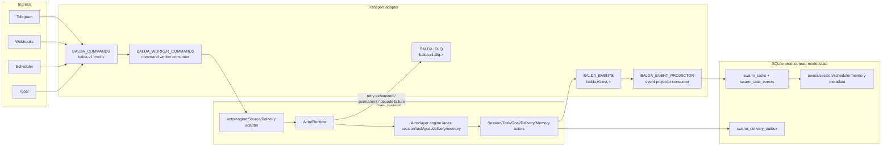

# Balda (V1)

`balda start` is a channel-aware background worker service that binds Telegram chats/topics to Balda worker sessions.

Architecture contracts are maintained in:

- `docs/architecture/index.md`

## Summary

- Runtime stack: one or more channel runtimes (Telegram, Zulip) plus the configured Balda provider runtime.
- Supported channels: Telegram (polling or webhook) and Zulip (outgoing webhook). Additional channels should be added as top-level config siblings such as `balda.whatsapp`.
- Main agent: Balda app key `balda.provider` (profile overrides via `profiles.<profile>.balda.provider`).
- Subagents: one session per Telegram topic (`message_thread_id`) with dedicated git worktree.
- Balda startup prompt includes workspace settings for each session; in git workspace mode it also includes session/base/current-branch context and workspace MCP guidance.
- Output streaming:
  - Progress updates: non-terminal provider progress emits channel progress. Telegram maps this to throttled typing indicators for all chats, plus DM-only thinking placeholders.
  - Final assistant response uses `balda.telegram.formatting_mode` (`rich_markdown|rich_html|markdownv2|html|none`; default `rich_markdown`).
- Auth model: one-time owner authorization with startup-generated token.

## User Onboarding Reference

The primary onboarding path runs Balda as a single app with its built-in
command/event runtime and local SQLite state. The runtime is bundled inside the
Balda process by default, so first-time setup does not require operating an
external queue service.

SQLite remains product/read-model state (owner/collaborator, session metadata,
task views, memory state, scheduler metadata, delivery outbox), not a command
queue.

npm remains the shortest install path:

```bash
npm install -g -y @normahq/balda
balda init
balda start
```

For repo-local development, run:

```bash
make dev
```

To exercise fake ingress scenarios (Telegram/webhook/scheduler paths), run:

```bash
make scenarios
```

To inspect the runtime streams and consumers, run:

```bash
make runtime-state
```

To replay projection events through the deterministic projector replay suite,
run:

```bash
make projection-replay
```

`balda init` requires a Telegram bot token, detects supported provider CLIs
(`codex`, `opencode`, `copilot`, `gemini`, `claude`), writes
`.config/balda/config.yaml`, initializes `.config/balda/state.db`, and prints
both an owner auth command and Telegram auth link. The default token storage is
CWD `.env` as `BALDA_TELEGRAM_TOKEN`.

Owner onboarding is completed in a direct message with the bot by opening the
printed auth link or sending:

```text
/start owner=<owner_token>
```

After owner auth, users can send normal direct messages to the bot's main DM
session or create a named topic session:

```text
/topic <name>
```

The supported Docker Compose onboarding path uses the shipped root
`Dockerfile` and `compose.yaml`:

```bash
docker compose build balda
docker compose run --rm balda init
docker compose up -d balda
```

The Compose service bind-mounts the current directory as `/workspace`, so the
container uses the same `.env`, `.config/balda/config.yaml`,
`.config/balda/state.db`, and `.git` as host execution.

## Key Internal Package Dependencies

This is a high-level map of Balda-owned internal packages. It is intentionally
selective rather than a full `go list` import dump.

```mermaid
flowchart TB
    balda_root["github.com/normahq/balda/internal/apps/balda"]
    agent["github.com/normahq/balda/internal/apps/balda/agent"]
    actors["github.com/normahq/balda/internal/apps/balda/actors"]
    auth["github.com/normahq/balda/internal/apps/balda/auth"]
    telegram["github.com/normahq/balda/internal/apps/balda/channel/telegram"]
    handlers["github.com/normahq/balda/internal/apps/balda/handlers"]
    memory["github.com/normahq/balda/internal/apps/balda/memory"]
    messenger["github.com/normahq/balda/internal/apps/balda/messenger"]
    session["github.com/normahq/balda/internal/apps/balda/session"]
    state["github.com/normahq/balda/internal/apps/balda/state"]
    swarm["github.com/normahq/balda/internal/apps/balda/swarm"]
    tgbotkit["github.com/normahq/balda/internal/apps/balda/tgbotkit"]
    welcome["github.com/normahq/balda/internal/apps/balda/welcome"]

    balda_root --> agent
    balda_root --> actors
    balda_root --> auth
    balda_root --> handlers
    balda_root --> memory
    balda_root --> state
    balda_root --> swarm
    balda_root --> tgbotkit

    actors --> agent
    actors --> telegram
    actors --> session
    actors --> state
    actors --> swarm

    telegram --> messenger
    telegram --> session

    handlers --> agent
    handlers --> auth
    handlers --> telegram
    handlers --> messenger
    handlers --> session
    handlers --> state
    handlers --> swarm
    handlers --> tgbotkit
    handlers --> welcome

    swarm --> memory
    swarm --> state

    session --> agent
    session --> state
```



### Dependency Summary

| Package | Import Path | Description | Depends On |
|---------|-------------|-------------|------------|
| `balda` | `internal/apps/balda` | Root application module | actors, agent, auth, handlers, memory, state, swarm, tgbotkit |
| `agent` | `internal/apps/balda/agent` | Agent builder & workspace manager | `internal/git`, `pkg/runtime/*` |
| `actors` | `internal/apps/balda/actors` | Balda product actors and actor command contracts | agent, channel/telegram, session, state, swarm |
| `auth` | `internal/apps/balda/auth` | Owner authentication store | state (interface) |
| `channel/telegram` | `internal/apps/balda/channel/telegram` | Telegram message adapter | messenger, session |
| `handlers` | `internal/apps/balda/handlers` | Telegram/webhook/scheduler ingress and command publishing | actors, agent, auth, channel/telegram, messenger, session, state, swarm, tgbotkit, welcome |
| `memory` | `internal/apps/balda/memory` | Structured memory store and recall helpers | (standalone) |
| `messenger` | `internal/apps/balda/messenger` | Telegram message sending | `tgbotkit/client` |
| `session` | `internal/apps/balda/session` | Session management | agent, state |
| `state` | `internal/apps/balda/state` | SQLite state persistence | `modernc.org/sqlite`, `updatepoller` |
| `swarm` | `internal/apps/balda/swarm` | Durable actor runtime, task services, and projections | memory, state, `pkg/actorlayer` |
| `tgbotkit` | `internal/apps/balda/tgbotkit` | Telegram bot runtime | `tgbotkit/*` |
| `welcome` | `internal/apps/balda/welcome` | Welcome message builder | (standalone) |

## Actorlayer Boundary

Balda treats `actorlayer` as the reusable actor library boundary and never as product policy.

- `balda.provider` selects one app-scoped provider runtime for all Balda sessions and `/goal` worker-validator runs in the process. `/goal` still creates isolated worker/validator ADK sessions and workspace state, but it reuses the same provider runtime/client ownership as normal session turns.
- Actorlayer owns generic actor mechanics: registration, addressing, envelopes, retry/error helpers, lane execution, lifecycle state, and transport-facing contracts.
- Balda owns product actors and product behavior implemented as actors: session turns, task routing, goal execution, delivery, control, and memory.
- Balda exposes its durable transport to product/runtime code only as actorlayer source, delivery, and dispatch abstractions; the concrete transport stays inside the NATS adapter.

The boundary is intentionally explicit:

- Balda owns retry, dead-letter, queue visibility, and task projection policy.
- Actor command contracts expose only actor-level contracts and metadata (`chat_id`, `topic_id`, `goal_id`, `attempt`).
- Runtime command flow and projectors are preserved by keeping queue/provider details outside actor definitions.

### Migration Checklist

- Keep Balda product actor definitions in `internal/apps/balda/actors`; keep ingress/Telegram command handling in `internal/apps/balda/handlers`.
- Keep actor definitions and state types independent from provider IDs.
- Ensure no provider or queue API types enter the actor layer contract.
- Keep retry/dead-letter policy, projection writes, and reporting in Balda-owned modules.
- Preserve command envelope metadata (`chat_id`, `topic_id`, `goal_id`) at the actorlayer boundary.
- Verify task/actor scenarios through the configured `balda.provider` runtime and actorlayer dispatch path.

### Implementation Map

Balda's actorlayer integration is intentionally direct:

- `internal/apps/balda/swarm/runtime.go`: consumes an `actorlayer/engine.Source` and owns actor lane execution.
- `internal/apps/balda/actors`: defines Balda product actors for session, task, goal, delivery, control, and memory command contracts.
- `internal/apps/balda/handlers`: owns ingress, command parsing, and dispatching actor command envelopes.
- `internal/apps/balda/eventbus/nats`: adapts transport publish, fetch, ack, retry, in-progress heartbeat, terminal dead-letter, and event-stream publishing into actorlayer source/delivery/dispatch contracts.
- `internal/apps/balda/agent` and `internal/apps/balda/session`: own the single app-scoped provider runtime selected by `balda.provider` and the per-session state.
- `internal/apps/balda/state`: owns SQLite product/read-model state for sessions, tasks, projections, memory, and delivery outbox rows.

Do not add extra Balda-local actor adapter packages or execution/delivery selector
layers around the runtime. The generic actor runtime lives in `pkg/actorlayer`,
and Balda keeps product policy in Balda.

## Startup Order (Required)

Balda startup order is strict:

1. Load runtime + balda config.
2. Start internal MCP lifecycle manager.
3. Start Balda provider runtime via `RuntimeManager.EnsureRuntime(...)`.
4. Start channel and ingress runtimes (Telegram, configured scheduler tasks, and inbound webhook receiver).

Internal MCP v1 scope is config + lifecycle plumbing; server implementations can be added incrementally.

## Configuration

Balda config is loaded from one selected file (priority order):

1. Embedded defaults (`cmd/balda/balda.yaml`)
2. Runtime config in `.config/balda/config.yaml`
3. Profile app overrides in the same file (`profiles.<name>.balda.*`)
4. Environment variables (`BALDA_*`) via Viper env mapping

Balda also auto-loads a `.env` file at startup (via `godotenv`) from the Balda process working directory only. Values loaded from `.env` are treated as environment variables, so `BALDA_*` entries override file config the same way as exported shell variables.
The selected config file is env-expanded before YAML parsing, so both `$VAR` and `${VAR}` placeholders work anywhere in that file. For `runtime.mcp_servers.<id>` entries with `type: stdio`, the launched MCP process inherits Balda's full process environment by default, and `env` overrides individual variables.

Example `.env`:

```dotenv
BALDA_TELEGRAM_TOKEN=123456:ABCDEF
BALDA_TELEGRAM_FORMATTING_MODE=rich_markdown
BALDA_TELEGRAM_WEBHOOK_ENABLED=true
BALDA_TELEGRAM_WEBHOOK_URL=https://example.com/telegram/webhook
```

Config shape:

```yaml
runtime:
  providers:
    <provider_id>:
      type: <provider_type>
  mcp_servers: {}
balda:
  provider: <provider_id>
  telegram:
    token: ""
    formatting_mode: "rich_markdown"
profiles:
  <profile>:
    balda:
      provider: <provider_id>
```

### Docker Compose Runtime

Balda ships a maintained root `Dockerfile` and `compose.yaml` for local Docker
Compose runtime. This path is the local workspace-oriented runtime: Compose
builds the image from the root Dockerfile and mounts the current project
directory as the runtime workspace.

The `Dockerfile` uses a Node Bookworm runtime with the common tools Balda needs:

```dockerfile
ARG NODE_IMAGE=node:24-bookworm
FROM ${NODE_IMAGE}

RUN apt-get update \
 && apt-get install -y --no-install-recommends \
      ca-certificates \
      curl \
      git \
      openssh-client \
      ripgrep \
 && rm -rf /var/lib/apt/lists/*

RUN npm install -g \
      @normahq/balda \
      @openai/codex \
      opencode-ai \
      @google/gemini-cli \
      @anthropic-ai/claude-code \
      @github/copilot \
 && npm cache clean --force

RUN command -v balda \
 && command -v codex \
 && command -v opencode \
 && command -v gemini \
 && command -v claude \
 && command -v copilot

USER node

WORKDIR /workspace
ENTRYPOINT ["balda"]
```

The `compose.yaml` uses a current-directory bind mount:

```yaml
services:
  balda:
    build: .
    working_dir: /workspace
    volumes:
      - .:/workspace
      - balda-home:/home/node
    command: start

volumes:
  balda-home:
```

With `.:/workspace`, Balda resolves the default runtime paths inside the mounted
project:

- `.env` is loaded from `/workspace/.env`.
- `.config/balda/config.yaml` remains the selected app config.
- `.config/balda/state.db` persists owner auth, session metadata, task
  read-model state, MCP KV, and Telegram polling offsets on the host.
- `.config/balda/MEMORY.md` stays on the host when `balda.memory.enabled=true`.
- `.git` stays visible to `balda.workspace.mode=auto|on`, so workspace mode sees
  the same repository as host execution.
- `balda-home` persists provider CLI auth/config written under `/home/node`.

Balda auto-loads `/workspace/.env`. `env_file: .env` is optional after the file
exists, but should not be required for the first `docker compose run --rm balda init`.

The container image bundles Balda plus every provider CLI detected by
`balda init`: `codex`, `opencode`, `copilot`, `gemini`, and `claude`. Claude
Code is detected through the real `claude` binary; `claudecode` is not a
supported binary name. Provider credentials are not baked into the image.
Authenticate through provider environment variables or by running provider login
commands through Compose. If you need fully repeatable builds, pin `NODE_IMAGE`
to a digest or concrete supported Bookworm tag, and pin the Dockerfile package
build args to exact npm versions: `BALDA_NPM_PACKAGE`, `CODEX_NPM_PACKAGE`,
`OPENCODE_NPM_PACKAGE`, `GEMINI_NPM_PACKAGE`, `CLAUDE_CODE_NPM_PACKAGE`, and
`COPILOT_NPM_PACKAGE`.

### Published GHCR Image

Balda also publishes an official container image at
`ghcr.io/normahq/balda:latest`. Unlike the local Compose Dockerfile, the
published image is built from the tagged source tree with
`Dockerfile.release`, so the Balda binary comes from the release commit rather
than from the npm package.

The published GHCR image is intentionally minimal. It contains only the
`/usr/local/bin/balda` binary and an absolute Balda entrypoint. It does not
bundle provider CLIs such as `codex`, `opencode`, `copilot`, `gemini`, or
`claude`, and it is not the documented all-in-one runtime equivalent of local
Compose.

Treat `ghcr.io/normahq/balda:latest` as a source stage for downstream bot
images. Copy `balda` from it, then add exactly the provider CLI runtime you
want in your own final image. A concrete Codex example:

```dockerfile
FROM node:24-bookworm-slim AS cli-builder
RUN npm install -g @openai/codex

FROM ghcr.io/normahq/balda:latest AS balda

FROM node:24-bookworm-slim
RUN apt-get update \
 && apt-get install -y --no-install-recommends \
      ca-certificates \
      git \
      openssh-client \
      ripgrep \
 && rm -rf /var/lib/apt/lists/*

COPY --from=cli-builder /usr/local/lib/node_modules /usr/local/lib/node_modules
COPY --from=cli-builder /usr/local/bin/codex /usr/local/bin/codex
COPY --from=balda /usr/local/bin/balda /usr/local/bin/balda

WORKDIR /workspace
ENTRYPOINT ["balda"]
```

In that pattern, your final runtime image owns provider auth, provider
environment variables, any extra system packages, and any persisted home
directory layout required by the selected CLI.

For the bundled local runtime flow, keep using the root `Dockerfile` and
`compose.yaml`. That Compose path still mounts the host checkout into
`/workspace`, keeps `.env`, `.config/balda/config.yaml`,
`.config/balda/state.db`, and `.git` on the host, and persists provider CLI
auth/config in the named `balda-home` volume.

The published image is released from Git tags through `release.yml` and is
currently tagged only as `latest`. OCI labels still record the release tag,
commit SHA, source repository, and build timestamp.

Polling mode is the default and does not require a published port. Webhook mode
requires `balda.telegram.webhook.enabled=true`,
`balda.telegram.webhook.url=https://.../telegram/webhook`, and a published local
listener such as `8080:8080`; TLS and public routing should be handled outside
the Balda process.

### MCP Server Configuration

MCP servers are configured in `runtime.mcp_servers` and referenced by providers via `runtime.providers.<id>.mcp_servers`.

#### Transport Types

| Type | Description |
|------|-------------|
| `stdio` | Process-based stdio communication (recommended for local tools) |
| `http` | HTTP transport with SSE streaming |
| `sse` | Server-Sent Events transport |

#### Stdio MCP Server Example

```yaml
runtime:
  mcp_servers:
    # Local Python tool server
    python-tools:
      type: stdio
      cmd: ["uv", "run", "mcp", "run", "path/to/server.py"]
      env:
        API_KEY: "${PYTHON_TOOLS_API_KEY}"
      working_dir: /path/to/project

    # Node.js based MCP server
    node-tools:
      type: stdio
      cmd: ["npx", "-y", "@modelcontextprotocol/server-filesystem", "/tmp"]
      env:
        DEBUG: "true"
```

#### HTTP MCP Server Example

```yaml
runtime:
  mcp_servers:
    remote-mcp:
      type: http
      url: https://mcp.example.com/mcp
      headers:
        Authorization: "Bearer ${MCP_TOKEN}"
```

#### Using MCP Servers in Providers

```yaml
runtime:
  mcp_servers:
    python-tools:
      type: stdio
      cmd: ["uv", "run", "mcp", "run", "server.py"]

  providers:
    codex:
      type: codex_acp
      codex_acp:
        reasoning_effort: high
      mcp_servers:
        - python-tools

balda:
  provider: codex
  mcp_servers: []  # extra servers added to all sessions
```

#### Bundled Balda MCP Server

The balda MCP server (`balda`) is automatically included in all sessions. It provides:

- `balda.state` - persistent key-value storage
- `balda.memory.read` - read `${balda.state_dir}/MEMORY.md` when `balda.memory.enabled=true`
- `balda.memory.remember` - append a durable fact to `${balda.state_dir}/MEMORY.md` when `balda.memory.enabled=true`
- `balda.workspace.import` - import workspace from base branch
- `balda.workspace.export` - export workspace to base branch

`balda.memory.remember` is for explicit user requests such as "remember this".
It updates the file immediately, but running agent sessions keep their existing
session-start snapshot. New or restored sessions read the latest file.

### Telegram settings

- `balda.telegram.token`: bot token (required)
  - `balda init` validates token via Telegram API and can store it either in:
    - CWD `.env` as `BALDA_TELEGRAM_TOKEN` (default)
    - balda config file key `balda.telegram.token`
  - when `.env` storage is selected, existing `.env` content is preserved and `BALDA_TELEGRAM_TOKEN` is upserted
- `balda.telegram.formatting_mode`: final assistant response format mode.
  - allowed values: `rich_markdown`, `rich_html`, `markdownv2`, `html`, `none`
  - default: `rich_markdown`
  - `rich_markdown` accepts Markdown/plain text from the model and sends it with Telegram rich messages
  - `rich_html` accepts rich-message HTML from the model and sends it with Telegram rich messages
  - `markdownv2` is the legacy mode that converts normal Markdown/plain text to Telegram MarkdownV2
  - `html` is the legacy mode that sends Telegram HTML with `parse_mode=HTML`
  - `none` is the legacy mode that sends raw text with no formatting mode
  - invalid values fail startup
  - see [Telegram Message Formatting](telegram-formatting.md) for supported tags, unsupported tags, and escaping behavior
- `balda.telegram.plan_updates`: surface work-plan snapshots in balda progress (default: `true`)
  - `true`: DM chats replace generic thinking placeholders with plan snapshots when the provider emits plan updates
  - `true`: public chats/topics send a plain-text message for each distinct plan snapshot
  - `false`: balda uses `typing` plus DM `Thinking...` drafts instead of plan snapshots
- `balda.telegram.webhook.enabled`: enable local HTTP webhook endpoint (`true` => webhook mode, `false` => polling mode; default: `false`)
- `balda.telegram.webhook.url`: outgoing Telegram webhook URL (required when `balda.telegram.webhook.enabled=true`)
- `balda.telegram.webhook.auth_token`: webhook auth token required when `balda.telegram.webhook.enabled=true`; Telegram sends it as `X-Telegram-Bot-Api-Secret-Token`
- `balda.telegram.webhook.listen_addr`: local webhook listen address (default: `0.0.0.0:8080`)
- `balda.telegram.webhook.path`: local webhook path (default: `/telegram/webhook`)
- `balda.zulip.bot_email`: Zulip outgoing webhook bot email (required when `balda.zulip.webhook.enabled=true`; env: `BALDA_ZULIP_BOT_EMAIL`)
- `balda.zulip.api_key`: Zulip bot API key used for REST replies (required when `balda.zulip.webhook.enabled=true`; env: `BALDA_ZULIP_API_KEY`)
- `balda.zulip.server_url`: Zulip server base URL, absolute `http://` or `https://` (required when `balda.zulip.webhook.enabled=true`; env: `BALDA_ZULIP_SERVER_URL`)
- `balda.zulip.webhook_token`: Zulip outgoing webhook token that must match the incoming payload token (required when `balda.zulip.webhook.enabled=true`; env: `BALDA_ZULIP_WEBHOOK_TOKEN`)
- `balda.zulip.allowed_owners`: Zulip user emails trusted to auto-claim topics by mentioning the bot; `BALDA_ZULIP_ALLOWED_OWNERS` accepts a comma-separated list
- `balda.zulip.webhook.enabled`: enable local Zulip outgoing webhook receiver (`true` => Zulip channel enabled; default: `false`; env: `BALDA_ZULIP_WEBHOOK_ENABLED`)
- `balda.zulip.webhook.listen_addr`: local Zulip webhook listen address (default: `0.0.0.0:8090`; env: `BALDA_ZULIP_WEBHOOK_LISTEN_ADDR`)
- `balda.zulip.webhook.path`: local Zulip webhook path, which must start with `/` (default: `/zulip/webhook`; env: `BALDA_ZULIP_WEBHOOK_PATH`)
- `balda.webhooks.enabled`: enable generic inbound webhook receiver (default: `false`)
- `balda.webhooks.listen_addr`: local inbound webhook listen address (default: `127.0.0.1:8090`)
- `balda.webhooks.routes`: route table keyed by route name
  - required when `balda.webhooks.enabled=true`
  - each route requires:
    - `path`: local inbound webhook path (for example `/webhook/release`)
    - `prompt_template`: Go `text/template` rendered with `RequestID`, `Path`, `Method`, `RawBody`, and `Headers`
  - optional `envelope`:
    - `target` + `key`: destination address (defaults to `alias` + `owner`)
      - `target=locator` consumes a locator ref in the form `<channel_type>:<address_key>`; `/locator` prints the current session value
    - `mode`: `task` (default) or `session`
    - `report_to`: optional destination for progress/final replies
  - optional `auth`:
    - `type`: `none` (default) or `header`
    - `header` + `value` (or `secret_env`) for `type=header`
  - optional `dedupe`:
    - `source`: `request_id` (default), `header`, or `body_sha256`
    - `header` required for `source=header`

### Balda settings

- `balda.working_dir`: optional balda working directory (defaults to process CWD)
- `balda.state_dir`: balda state directory for persistent balda SQLite state (`state.db`).
  - Stores owner/app KV, `balda.state` MCP KV, session metadata, task/read-model state, optional session history, and Telegram polling offset.
  - Schema is migration-versioned and auto-applied on startup.
  - Relative paths are resolved from `balda.working_dir`.
  - Default: `.config/balda`
- `balda.sessions.persistence`: `sqlite|memory` (default `sqlite`)
  - `sqlite`: session history and state are persisted in `state.db` and reused after restart until the session is explicitly closed.
  - `memory`: conversation/runtime state is process-local; only Balda metadata is persisted.
- `balda.memory.enabled`: enable internal durable memory (default `true`)
  - when disabled, Balda does not snapshot `MEMORY.md` or register `balda.memory.*` MCP tools.
- `balda.goal.max_iterations`: maximum `/goal` worker-validator loop iterations (default `25`)
  - invalid values are clamped to `25`.
- `runtime.providers.<provider_id>.codex_acp.reasoning_effort`: optional Codex reasoning effort.
  - allowed values: `minimal`, `low`, `medium`, `high`, `xhigh`
  - Balda passes the value through to Norma, which maps it to Codex ACP session startup/recovery metadata
- `balda.nats.embedded`: run Balda-owned NATS inside the process (default `true`)
- `balda.nats.host` / `port`: embedded listener address (default `127.0.0.1:-1`, random local port)
- embedded NATS transport files live under `${balda.state_dir}/nats`
- `balda.nats.max_memory` / `max_store`: embedded runtime resource caps (defaults `256mb` and `2gb`)
- `balda.swarm`: optional advanced runtime tuning for command handling, retries, backpressure, and failure retention. Most installs should leave it at defaults.
- `/goal` runs repeated work and validation passes in isolated GoalKeeper worker/validator ADK sessions until the goal passes validation or `balda.goal.max_iterations` is reached.
  - with workspace mode enabled, `/goal` uses a separate goal worktree and exports passing work to `balda.workspace.base_branch`.
  - with workspace mode disabled, `/goal` works directly in `balda.working_dir` and records `not_exported` on passing runs.
- internal durable memory uses `${balda.state_dir}/MEMORY.md` when `balda.memory.enabled=true`
  - `balda.memory.read` reads the file from MCP.
  - `balda.memory.remember` appends facts to the file from MCP.
  - memory is snapshotted into session state when a session starts or restores; active sessions are not refreshed after writes.
- owner auth token is generated during `balda init`, persisted in `state.db`, and reused by `balda start`
  - if token is missing in existing state, `balda start` backfills one-time and persists it
  - if no owner is registered yet, `balda start` logs the owner bootstrap command and auth link again to help finish first-time onboarding
  - after the first successful owner auth, normal startup logs go back to bot identity only and no longer expose owner auth tokens or auth links
  - if an owner is already registered, `balda start` fails fast when the owner session cannot be restored or created
- bundled balda MCP listener always binds to local ephemeral address (`127.0.0.1:0`)
  - bundled routes on this listener:
    - `/mcp` and `/mcp/balda` for the built-in balda MCP server
- Balda config is edited via the config file itself, not through MCP.
  - balda agents should use the config path shown in the system instruction and edit `.config/balda/config.yaml` directly
- `balda.mcp_servers`: extra MCP server IDs for all balda-started sessions (must reference IDs declared in `runtime.mcp_servers`)
  - effective MCP IDs = bundled defaults + `runtime.providers.<provider_id>.mcp_servers` + `balda.mcp_servers` (deduplicated)
- `balda.global_instruction`: optional balda-wide global instruction applied to all sessions
  - value: global instruction text included in balda prompt for all agents
  - effective balda instruction order: built-in balda instructions + `balda.global_instruction` + `runtime.providers.<provider_id>.system_instructions`
  - `balda init` generates a channel-aware example prompt
- `balda.workspace.mode`: `on|off|auto` (default `auto`)
  - `on`: always use Git worktrees per session; startup fails if `working_dir` is not a Git repository
  - `off`: run agents directly in balda `working_dir` (no `balda.workspace` namespace)
  - `auto`: enable worktrees only when `working_dir` is a Git repo, otherwise fallback to `off`
- `balda.workspace.base_branch`: base branch used for workspace sync/export (for example `main`, `master`, `develop`)
  - `balda init` detects current HEAD branch and writes it when available
  - if empty, balda resolves base branch from current HEAD at startup
  - `balda.workspace.export` requires main repo to be on this branch
- `balda.workspace.sessions_dir`: directory name under `balda.state_dir` used for per-session worktrees
  - defaults to `sessions`
- Balda auto-starts only its built-in `balda` MCP server. Any additional MCP
  servers must be declared explicitly through `runtime.mcp_servers`,
  provider-level `mcp_servers`, or `balda.mcp_servers`.

## Session Model

Session key:

- Owner session: owner DM `(chat_id, topic_id=0)`
- Regular session: any other channel address `(chat_id, topic_id)`, including public `topic_id=0`
- Canonical Balda session IDs are channel-scoped. Telegram uses `tg-<chat_id>-<topic_id>`.
- The owner session is bootstrapped for the bound owner DM chat (`topic_id=0`) during activation/startup when an owner is already registered.

Balda always persists session metadata in `state.db` for lazy restore.
By default, Balda also persists session history and state in `state.db` until the session is explicitly closed. Set `balda.sessions.persistence=memory` to keep conversation/runtime state process-local while retaining Balda session metadata for lazy restore.

## Message Flow

1. User sends Telegram message.
   - In non-DM chats (groups/supergroups/topics), Balda processes a message when it contains a mention entity for `@<bot_username>` or is a reply to this bot's message.
   - For processed replies, balda forwards replied message `text` (fallback `caption`) as model context, plus the new user message when present.
   - In DM chats, Balda processes non-command text messages normally and preserves reply context for reply messages.
2. Balda resolves session by `(chat_id, topic_id)`.
3. If the session is missing in memory, balda attempts lazy restore from persisted metadata.
4. Balda calls the configured provider runtime for that session.
5. Balda streams non-terminal provider progress to Telegram via chat actions (and DM thinking placeholder updates).

## Telegram Messaging Behavior

Per model turn:

1. Non-terminal provider progress sends throttled typing indicators for the same chat/topic; DM chats also emit throttled thinking placeholders.
   When `balda.telegram.plan_updates=true`, work-plan snapshots replace generic DM thinking placeholders and are sent as plain-text progress messages in public chats/topics.
2. Final assistant text uses `balda.telegram.formatting_mode`:
   - `rich_markdown`: model writes Markdown/plain text; Balda sends Telegram rich Markdown.
   - `rich_html`: model writes rich-message HTML; Balda sends Telegram rich HTML.
   - `markdownv2`: model writes Markdown/plain text; Balda converts it to Telegram MarkdownV2.
   - `html`: model writes Telegram HTML; Balda escapes unsafe raw text and preserves supported Telegram HTML tags.
   - `none`: Balda sends raw text with no formatting mode.
3. If rich-message delivery fails at transport or formatting-validation level, balda retries once using the legacy path for that mode.

## Topic Sessions

Balda runs with a single provider per process (`balda.provider`).

- The provider is initialized before message handling.
- The owner main-DM session (`topic_id=0` in the owner DM) is bootstrapped for the owner chat during activation.
- On restart, that owner main-DM session follows the same restore path as regular sessions: restore persisted metadata first, then fall back to fresh create only when no persisted record exists.
- Other direct-message main-chat sessions and public/topic sessions are restored or created lazily on demand, but all sessions in that balda instance use the same provider runtime.

### Manual session control

- `/topic <name>` (DM only, owner/collaborator): creates a new Telegram topic and a topic-bound session.
  - `<name>` is required.
  - `<name>` is a session label, not a provider selector.
- `/goal <objective>` (owner/collaborator): starts goal work from the current session context in isolated GoalKeeper worker/validator ADK sessions. With workspace mode enabled, Balda creates a goal workspace from `balda.workspace.base_branch`, exports it back automatically on success, and preserves it for recovery when export fails. With workspace mode disabled, GoalKeeper works directly in `balda.working_dir` and records `not_exported` on success. Started/validation/final updates use `balda.telegram.formatting_mode`; terminal updates include Result, Artifacts, Confidence, and Next action sections. See the [goal workflow doc](goal-workflow.md).
  - concurrent `/goal` runs in the same session are rejected.
  - `/goal clear` stops active goal work for the current session only.
- `/reset`, `/restart` (owner/collaborator): cancel current session work, clear the current session history, and immediately start a fresh runtime session without closing the chat/topic. Both commands work in the current DM, public-chat, or thread-scoped session.
- `/locator` (owner/collaborator): replies with the current transport type and locator ref in the public config form `<channel_type>:<address_key>`. Use that value with `target: locator` in scheduler/webhook config.
- `/close` (DM only, owner/collaborator): resets the current session history. In topic contexts, it also closes that topic.
- `/cancel` (owner/collaborator): cancels the current session turn and drops queued turns for that session. It does not stop active `/goal` work.
- `/user add` (owner only): generates a collaborator invite link for this bot.
- `/user list` (owner only): lists collaborators and active invites.
- `/user remove <user_id>` (owner only): removes a collaborator by ID.
- `balda.memory.*` MCP tools are internal capabilities, not chat commands.

### Task runtime semantics (internal)

Assignable work is persisted in `swarm_tasks`; task history is published to
`BALDA_EVENTS` and projected into `swarm_task_events`. Ingress publishes a
durable command first; task records are created after command delivery.

- `/goal` starts goal work for the current session context. Balda restores or creates the
  chat session, allocates separate GoalKeeper worker/validator ADK sessions for the
  task, runs repeated work and validation passes, passes only the latest worker and
  validator results across those role sessions, exports successful work back to the
  base branch when workspace mode is enabled, records `not_exported` when workspace
  mode is disabled, records the task result, and sends progress/final messages.
- Task statuses are `created`, `queued`, `running`, `waiting_for_agent`,
  `waiting_for_user`, `validating`, `completed`, `failed`, `canceled`, and
  `deadlettered`.
- Task events are append-only durable transport events projected into SQLite read
  models. Event projection failure never decides command success. Semantic
  event types include `task.created`, `task.assigned`, `task.started`,
  `agent.started`, `agent.progress`, `agent.result`, `task.validating`,
  `task.completed`, `task.failed`, `task.canceled`, `delivery.sent`, and
  `delivery.failed`.
- Runtime deadletters mark the owning task `deadlettered`. Session control
  commands and internal control envelopes publish durable control work.
  `/cancel` stops the current session turn and clears queued turns for that
  session. `/goal clear` marks active goal tasks `canceled` and stops any
  currently running GoalKeeper task for that session.
- Terminal task delivery stores and, when applicable, sends reviewable
  outcomes with:
  Result, Artifacts, Confidence, and Next action. Artifacts are best-effort
  workspace data from the bound session: changed files, branch, current commit,
  workspace export hint, and validation output.
- Task progress/results and projected event payload summaries redact common
  secret patterns (for example bearer tokens, `token=...`, `password=...`,
  Telegram bot tokens, and PEM private keys) before persistence and delivery.
- Task records and projected task events remain internal runtime/operator data.
  Telegram does not expose direct task inspection or per-task control commands.

### Command runtime semantics (internal)

Balda uses its durable transport adapter behind actorlayer dispatch, source,
delivery, retry, replay, event, and DLQ contracts. SQLite remains
product/read-model state only; it does not decide what runs, retries, or wakes
up.



- Ownership boundary:
  - The NATS transport adapter owns durable storage and wire-level settlement
    inside `internal/apps/balda/eventbus/nats`.
  - Actorlayer `Source`/`Delivery`/dispatch contracts are the boundary consumed
    by runtime, handlers, and product actors.
  - SQLite owns product state/read models (`swarm_tasks`, projected
    `swarm_task_events`, delivery outbox records, session metadata, memory
    state, scheduler metadata).
  - Projections are derived views; projection lag/failure never blocks command
    settlement.
- Command lifecycle events (`command.accepted`, `command.running`,
  `command.in_progress`, `command.acked`, `command.retrying`,
  `command.deadlettered`, `command.noop`, `command.decode_failed`) are
  best-effort visibility telemetry. Command ack/nak/term settlement does not
  depend on successful lifecycle event publication.

#### Projection rules

- Projection input source is `BALDA_EVENTS` only. Projectors must not read
  command ownership from SQLite queue rows.
- Projectors are idempotent by event identity (`event_id`/message identity) and
  can safely replay events after restart.
- Projection failure does not block command execution or transport command
  settlement. Command success/failure is decided by actor side effects plus
  transport ack/nak/term only.
- Permanent projection decode/apply failures are terminated to `BALDA_DLQ`
  with source envelope and failure reason.
- Projection lag is expected and observable through operator logs and internal tooling; lag recovery happens by durable consumer catch-up.
- Read models are eventually consistent projections, not the command transport source of truth.

- Required streams:
  - `BALDA_COMMANDS`: work-queue stream for `balda.v1.cmd.>` commands.
  - `BALDA_EVENTS`: limits-retention stream for `balda.v1.evt.>` events.
  - `BALDA_DLQ`: limits-retention stream for terminal failures on
    `balda.v1.dlq.>`.
- Required consumer:
  - `BALDA_WORKER_COMMANDS`: command worker consumer with explicit ack,
    redelivery, `NakWithDelay`, and `InProgress` heartbeat support.
  - `BALDA_EVENT_PROJECTOR`: event projector consumer that projects
    `BALDA_EVENTS` into SQLite read models. Permanent projection failures are
    terminated to `BALDA_DLQ`; transient failures retry with bounded delivery.

#### Stream/consumer table

| Name | Type | Subject filter | Retention / delivery | Key config |
|---|---|---|---|---|
| `BALDA_COMMANDS` | durable command stream | `balda.v1.cmd.>` | work-queue retention | file storage, configurable limits/discard policy |
| `BALDA_EVENTS` | durable event stream | `balda.v1.evt.>` | limits retention | file storage, replay source for projections |
| `BALDA_DLQ` | durable DLQ stream | `balda.v1.dlq.>` | limits retention | file storage, terminal failure inspection source |
| `BALDA_WORKER_COMMANDS` | command worker consumer (on `BALDA_COMMANDS`) | `balda.v1.cmd.>` | deliver-all + explicit ack | `ack_wait`, `max_deliver`, `max_ack_pending`, `fetch_batch`, `fetch_wait` |
| `BALDA_EVENT_PROJECTOR` | event projector consumer (on `BALDA_EVENTS`) | `balda.v1.evt.>` | deliver-all + explicit ack | same retry/backpressure knobs as command consumer; projector applies idempotent read-model updates |

- Stable subjects:
  - Commands: `balda.v1.cmd.session`, `balda.v1.cmd.task`,
    `balda.v1.cmd.goal`, `balda.v1.cmd.delivery`,
    `balda.v1.cmd.control`.
  - Events: `balda.v1.evt.command.accepted`,
    `balda.v1.evt.command.running`, `balda.v1.evt.command.in_progress`,
    `balda.v1.evt.command.acked`, `balda.v1.evt.command.retrying`,
    `balda.v1.evt.command.deadlettered`, `balda.v1.evt.command.noop`,
    `balda.v1.evt.command.decode_failed`,
    `balda.v1.evt.task.created`,
    `balda.v1.evt.task.updated`, `balda.v1.evt.task.completed`,
    `balda.v1.evt.delivery.sent`, `balda.v1.evt.delivery.failed`.
  - DLQ: `balda.v1.dlq.command`.

#### Command schema table

All commands use the common envelope schema:
`id`, `namespace`, `kind`, `from`, `to`, `payload_json` are required.
`session_id`, `task_id`, `correlation_id`, `causation_id`, `dedupe_key`,
`priority`, `meta`, and `report_to` are optional context fields.

| Subject | Primary routing rule | Typical namespaces | Required contextual fields | Payload contract |
|---|---|---|---|---|
| `balda.v1.cmd.session` | `to.target=session` or namespace fallback | `human.inbound` | `session_id` for existing sessions | session-turn payload (prompt/content + locator/user metadata) |
| `balda.v1.cmd.task` | `to.target=task` or namespace fallback | `webhook.inbound`, `schedule.inbound` | `task_id` for existing task mutations; optional on task creation commands | webhook task or scheduled task payload |
| `balda.v1.cmd.goal` | `to.target=goal` | `goal.command` | `task_id` for goal runs | goal objective/session payload |
| `balda.v1.cmd.delivery` | `to.target=delivery` | `agent.result` / delivery work namespaces | channel-qualified delivery address in `to.key` (`<channel_type>:<address_key>`); `task_id` when task-owned | outbound delivery payload (channel message/terminal update) |
| `balda.v1.cmd.control` | `namespace=task.control` (forced) | `task.control` | `task_id` and/or `session_id` | cancel/control payload (`reason`, actor/user origin) |

Deduplication policy for all command subjects: transport message ID uses
`dedupe_key` when present, otherwise `id`.

#### Event schema table

All events are published as the same envelope shape. For event envelopes,
`namespace=telemetry` is standard, `kind` is typically `command_event` or
`task_event`, and `meta.event_type` carries the semantic type.

| Subject | Semantic event type | Required envelope fields | Required payload fields | Producer |
|---|---|---|---|---|
| `balda.v1.evt.command.accepted` | `command.accepted` | `id`, `task_id` (when task-scoped), `namespace`, `kind=command_event` | `envelope_id`, `status=accepted`, `namespace` | command publish path |
| `balda.v1.evt.command.running` | `command.running` | same as above | `envelope_id`, `status=running` | command consumer before actor dispatch |
| `balda.v1.evt.command.in_progress` | `command.in_progress` | same as above | `envelope_id`, `status=in_progress` | runtime heartbeat during long work |
| `balda.v1.evt.command.acked` | `command.acked` | same as above | `envelope_id`, `status=acked` | command consumer after successful ack |
| `balda.v1.evt.command.retrying` | `command.retrying` | same as above | `envelope_id`, `status=retrying`, `reason` | command consumer on retryable failure |
| `balda.v1.evt.command.deadlettered` | `command.deadlettered` | same as above | `envelope_id`, `status=deadlettered`, `reason` | command consumer/DLQ publisher |
| `balda.v1.evt.command.noop` | `command.noop` | same as above | `envelope_id`, `status=noop`, `reason` | command publish dedupe path |
| `balda.v1.evt.command.decode_failed` | `command.decode_failed` | `id`, `namespace`, `kind=decode_failed` | `subject`, `reason`, `payload` | command consumer poison-message path |
| `balda.v1.evt.task.created` | `task.created` | `id`, `task_id`, `namespace`, `kind=task_event` | task lifecycle details | task lifecycle handling |
| `balda.v1.evt.task.updated` | `task.updated` | `id`, `task_id`, `namespace`, `kind=task_event` | task lifecycle details | task lifecycle handling |
| `balda.v1.evt.task.completed` | `task.completed` | `id`, `task_id`, `namespace`, `kind=task_event` | terminal task outcome details | task lifecycle handling |
| `balda.v1.evt.delivery.sent` | `delivery.sent` | `id`, `task_id` (when task-scoped), `namespace`, `kind=task_event` | delivery metadata (`delivery_key`, channel/provider ids when available) | delivery handling |
| `balda.v1.evt.delivery.failed` | `delivery.failed` | `id`, `task_id` (when task-scoped), `namespace`, `kind=task_event` | delivery failure details (`reason`, delivery metadata when available) | delivery handling |

#### Idempotency rules

- Command publish idempotency:
  - transport `MsgID` is `dedupe_key` when present, otherwise envelope `id`.
  - duplicate publishes emit `command.noop` and do not create duplicate command work.
- Command consumption idempotency:
  - all handlers must tolerate redelivery (`at-least-once`).
  - terminal/canceled task commands settle as ack/noop instead of repeating side effects.
- Projection idempotency:
  - projector writes use stable event IDs and `INSERT OR IGNORE` semantics in SQLite.
  - replaying the same event stream must not duplicate projected task events.
- Delivery idempotency:
  - delivery work reserves `delivery_key` in `swarm_delivery_outbox` before provider send.
  - duplicate delivery reservations become noop, preventing duplicate user-visible messages.
- Task lifecycle idempotency:
  - task status transitions are guarded and terminal states are immutable.
  - repeated terminal lifecycle commands/events keep task state unchanged.

#### Retry and DLQ rules

- Retry classification:
  - retryable failures are settled with `NakWithDelay` and emit `command.retrying`.
  - permanent/policy/decode terminal failures are settled with `TermWithReason` and emit/persist `command.deadlettered` or `command.decode_failed`.
- Retry schedule:
  - backoff is exponential with bounded cap (base `1s`, max `1m`), constrained by consumer `max_deliver`.
  - long-running handlers send `InProgress` heartbeats to prevent premature redelivery.
- Retry exhaustion:
  - when delivery attempts reach `max_deliver`, command is moved to `BALDA_DLQ` with reason `retry exhausted: <error>`.
- DLQ payload contract:
  - keeps original envelope identity/routing/payload (`id`, namespace, from/to, task/session scope).
  - includes failure reason and transport origin metadata (subject/headers for poison decode cases).
- Operational inspection:
  - inspect DLQ stream contents, transport metadata, and structured logs when command failures need replay or triage.

#### Failure-mode matrix

| Failure mode | Where detected | Settlement/result | User-visible impact | Operator action |
|---|---|---|---|---|
| Transport unavailable at startup | app startup/runtime bootstrap | startup fails fast | ingress not started; no work accepted | restore NATS transport and restart |
| Command publish rejected (queue pressure/transport) | ingress publish path | request rejected (`queue_full`/`dispatch_failed`) | command not accepted; no task created | inspect stream limits/backpressure, retry ingress |
| Envelope decode failure (command consumer) | command consumer decode | `TermWithReason`, publish poison record to `BALDA_DLQ`, emit `command.decode_failed` | affected message skipped; no handler side effects | inspect DLQ payload, fix producer/schema, replay if needed |
| Retryable actor/runtime error | command handler/runtime | `NakWithDelay`, emit `command.retrying` | delayed completion | inspect retries, root-cause transient dependency failures |
| Retry exhaustion (`max_deliver` reached) | command consumer | publish `BALDA_DLQ`, `TermWithReason`, emit `command.deadlettered` | task may end `deadlettered`; no further retries | inspect DLQ entries and logs, replay/fix or cancel |
| Permanent actor/runtime error | handler/runtime classification | publish `BALDA_DLQ`, `TermWithReason` | task fails/deadletters without retry loop | inspect reason, patch code/config, replay if safe |
| Projection apply/decode failure | event projector consumer | retry for transient; terminal to DLQ for permanent | command flow continues; read models may lag until replay or repair | inspect projector logs and replay state, fix the bug, replay events |
| Delivery redelivery after partial send | delivery outbox reserve | duplicate suppressed by delivery key (noop path) | final user message not duplicated | inspect outbox row/status if delivery appears missing |
| Cancellation races with queued/running work | control command handling | control command applied; canceled/terminal commands settle noop/ack | task/session stops promptly, later duplicates ignored | verify task state/events; no queue surgery needed |

- NATS identity is carried in headers: `Balda-Envelope-ID`,
  `Balda-Session-ID`, `Balda-Task-ID`, `Balda-Correlation-ID`,
  `Balda-Causation-ID`, `Balda-Dedupe-Key`, `Balda-Actor-Key`,
  `Balda-Priority`, and `Balda-Namespace`.
- Embedded NATS binds to `127.0.0.1` by default and is not exposed externally.
  NATS transport files live under `${balda.state_dir}/nats`, which is runtime state and should
  not be committed.
- Poison command/event messages that cannot decode as Balda envelopes are
  terminated and copied to `BALDA_DLQ` with the raw subject, headers, payload,
  and decode reason.
- Task-mutating envelopes are serialized on a single task lane
  (`task:<task_id>`) across task control, goal command/result, and task-bound
  human/webhook/schedule ingress. Different task IDs still run concurrently.
- Command consumer backpressure boundary:
  - Command worker consumer (`BALDA_WORKER_COMMANDS`) is the transport queue.
  - Local in-process worker fan-out is capped to `fetch_batch` (not `max_ack_pending`) to avoid creating a second deep in-memory queue ahead of actor lanes.
  - `max_ack_pending` remains a transport limit; it is not used as local goroutine fan-out.

### Command-path queue ownership (internal)

- Command stream (`BALDA_COMMANDS`):
  - owner: NATS transport adapter
  - capacity/backpressure: stream limits + discard policy (`balda.nats.streams.commands.*`)
  - retry/redelivery: transport consumer (`Ack`, `NakWithDelay`, `InProgress`, `Term`)
  - inspection: transport stream metadata (`messages`, `bytes`, seq range`) and logs
- Worker consumer (`BALDA_WORKER_COMMANDS`):
  - owner: NATS transport adapter
  - capacity: `max_ack_pending`
  - fetch window: `fetch_batch`, `fetch_wait`
  - inspection: transport consumer metadata (`num_pending`, `num_ack_pending`, `num_redelivered`) and logs
- Local actor delivery workers:
  - owner: process-local transport actorlayer source adapter
  - capacity: `fetch_batch` (bounded local fan-out)
  - behavior: no persistence, no retry policy; settlement remains transport-owned
- Actor lanes:
  - owner: process-local actorlayer runtime engine
  - capacity: 1 active handler per actor key (`task:<id>`, session/goal fallbacks)
  - behavior: serializes mutable task/session state transitions
- Session turn queue:
  - owner: process-local session turn dispatcher
  - capacity: bounded by turn-dispatcher queue size
  - behavior: per-session ordering/cancel semantics for provider turn execution

### Scheduled task runtime semantics (internal)

Balda includes an internal scheduler backed by `balda_scheduled_tasks`.
Tasks are managed from config on startup using `balda.scheduler.tasks`.
Each configured task has `id`, `cron`, and an `envelope` with `target`, `key`,
`content`, and optional `report_to`.

- Eligibility: only `status=active` tasks with `next_run_at <= now` are polled.
- Dispatch path: due tasks resolve the envelope target by `target`/`key`, persist its canonical locator (`channel_type`, `address_key`, `address_json`, `session_id`), and publish a durable task command. Session restore and execution happen after command delivery.
- Locator target form: `target=locator`, `key=<channel_type>:<address_key>`; `/locator` prints a paste-ready value for the current session.
- Delivery: scheduled tasks are fire-and-forget by default. If `envelope.report_to` is set, the session turn delivers progress/final replies to that locator.
- Idempotency key: each due slot uses deterministic `last_dispatch_key = <task_id>@<due_next_run_at_rfc3339nano>`.
- Startup reconciliation: configured task IDs are upserted, and persisted tasks not present in config are deleted from the scheduler state.
- Publish-before-mark: scheduler publishes the command first, then writes `last_dispatch_key` and advances `next_run_at`, so a failed publish does not mark work dispatched.
- Success after actor execution: `last_run_at` is updated, `last_error` is cleared, `retry_count` is reset to `0`, and the task remains `active`.
- Pre-publish failure: target resolution, invalid schedule, or transport publish failure increments `retry_count`, records `last_error`, and may pause the task after `max_retries`.
- Execution failure after transport delivery: `last_run_at` and `last_error` are recorded for visibility, but scheduler retry fields and `next_run_at` are not changed. Transport owns command retry, redelivery, and DLQ after publish.
- Pre-publish retry delay policy: linear backoff in seconds (`1s`, `2s`, `3s`, ...) capped at `60s`.

### Inbound webhook contract (internal)

 Balda can optionally expose local webhook routes that map path -> route envelope.

- Endpoint config: `balda.webhooks.enabled`, `listen_addr`, `routes`.
- Security:
  - each route can require shared-header auth (`auth.type=header`, `auth.header`, `auth.value|secret_env`)
  - keep the endpoint private or protected by a trusted gateway even with route auth
- Method: `POST` only.
- Route resolution:
  - request path must match a configured route `path`
  - destination comes from route `envelope.target` + `envelope.key` (default `alias:owner`)
  - `target=locator` accepts `<channel_type>:<address_key>` in `key`; `/locator` prints the current session value
  - route `envelope.mode` decides publish target:
    - `task` (default): publish webhook task command; task execution later emits the session command
    - `session`: publish session command directly
- Prompt generation:
  - request body is treated as opaque raw text
  - route `prompt_template` is rendered with `RequestID`, `Path`, `Method`, `RawBody`, `Headers`
  - rendered prompt must be non-empty
- Session resolution:
  - ingress resolves route target locator and user id from owner store aliases
  - ingress publishes a durable command after prompt rendering
  - task mode: the task command later emits the session command for execution
  - session mode: ingress command is already a session command
  - the runtime lazily restores the persisted session when inactive in memory and creates the owner session when no persisted session exists
  - webhook acceptance therefore depends on transport publish, not on synchronous session restore
  - uses `deliver=false` by default; route `envelope.report_to` enables progress/final delivery to that destination
- Dedupe:
  - default source is `request_id`
  - `dedupe.source=header` uses `dedupe.header` value when present
  - `dedupe.source=body_sha256` uses body hash
- Response model (JSON):
  - accepted: `202` with `{status:"accepted", accepted:true, request_id, message_id, duplicate?}`
  - route not found: `404` + `error.code="route_not_found"` + message `could not accept request`
  - invalid method: `405` + `error.code="invalid_method"` + message `could not accept request`
  - auth reject: `401` + `error.code="unauthorized"` + message `could not accept request`
  - invalid body/template render: `400` + `error.code="invalid_payload"` + message `could not accept request`
  - unresolved/restore-failed session: `404` + `error.code="session_not_found"` + message `could not accept request`
  - queue pressure: `429` + `error.code="queue_full"` + message `temporarily busy`
  - transport publish/internal failures: `503` + `error.code="dispatch_failed"` + message `temporarily busy`
- Observability:
  - logs keep request routing and transport metadata internal; public responses stay limited to request id, message id, status, acceptance, and stable error code/message values
  - internal outcome counters track accepted, invalid, not-found, queue-full, and dispatch-failure events

### Session restore/create behavior

- Balda restores persisted session metadata on first message after restart.
- When `balda.sessions.persistence=sqlite`, restore reuses the stable session ID and prior session history/state.
- Persisted session label is reused as-is for restore; if missing, balda falls back to label `auto`.
- In workspace mode, restore first tries to sync the session branch with the configured base branch.
- If that sync conflicts, balda recreates a clean worktree on the persisted session branch, restores the session anyway, and sends a short warning that the workspace was reset to the saved session-branch state and Balda can retry the sync later.
- If no persisted session metadata exists, balda creates a new regular session using label `auto`.
- Public-channel welcome banners always display `Name: balda` to keep app identity stable, even when the internal persisted session label differs.
- Welcome message uses a user-friendly MarkdownV2 format:
  - Example:
    🚀 **Session Started** • **Name:** `balda` • **ID:** `tg-1-0` • **Model:** `opencode/big-pickle` • **Type:** `opencode_acp` • **MCP:** `balda`

### Workspace allocation contract

- Workspace allocation is session-scoped:
  - session branch name: `norma/balda/<session_id>`
  - workspace dir root: `${balda.state_dir}/<balda.workspace.sessions_dir>/<session_id>` (defaults to `sessions`)
- Allocation lifecycle:
  - on session create/restore in workspace mode, Balda ensures a dedicated worktree at that path
  - if the workspace path already exists with a different branch binding, Balda rejects it as a workspace collision
  - on normal close/stop flows, Balda removes the worktree mount via `CleanupWorkspace`
- Restore and sync behavior:
  - Balda first tries to import/rebase the session branch onto `balda.workspace.base_branch`
  - on conflict, Balda remounts a clean worktree on the same session branch and marks sync skipped
  - the agent/runtime can retry sync later with `balda.workspace.import`; the chat-facing warning does not expose MCP tool names directly
- Source of truth:
  - persisted metadata (`workspace_dir`, `branch_name`) is stored in `state.db` session records
  - task and goal work resolve workspace metadata from session info when commands are dispatched and handled

## Troubleshooting

- Startup fails while initializing built-in runtime streams: keep the default `balda.nats` settings unless you have a specific local runtime need, ensure `${balda.state_dir}/nats` is writable, and verify local disk limits.
- Startup fails while initializing built-in runtime consumers: verify `balda.swarm.commands.consumer` uniqueness and avoid concurrent writers against the same embedded NATS store dir.
- Rising command backlog or redelivery counts in transport metadata usually means retrying or deadlettering work; inspect lifecycle events, DLQ stream contents, and logs before increasing `max_ack_pending` or `fetch_batch`.
- Webhook ingress returns `503 dispatch_failed`: confirm transport startup succeeded and command publish acknowledgements are being returned.

## Workspace MCP Usage

- `balda.workspace.import`
  - rebases the session workspace onto the configured base branch
  - works for active or persisted sessions as long as workspace metadata exists in `state.db`
  - is the explicit retry path when restart restore skipped base sync because of a conflict
- `balda.workspace.export`
  - squash-merges the session workspace branch into the configured base branch with the provided Conventional Commit message
  - also works for persisted sessions before lazy restore
- Cleanup/export contract is explicit:
  - `/close`, session stop, and process shutdown clean up the mounted worktree path when workspace mode is enabled
  - cleanup does **not** auto-export branch changes into the base branch
  - exporting branch changes is an explicit operator action via `balda.workspace.export`

## Acceptance/Verification Scenarios

1. Startup order enforces internal MCP -> Balda provider -> bot runtime.
2. Polling mode starts by default when `balda.telegram.webhook.enabled=false`.
3. Webhook mode (`balda.telegram.webhook.enabled=true`) fails fast without `balda.telegram.webhook.url` or `balda.telegram.webhook.auth_token`.
4. `/start owner=<token>` registers owner once; `/start invite=<token>` onboards collaborators; users who are neither owner nor collaborator are otherwise rejected.
5. `/topic <name>` creates topic + Balda session and persists session metadata.
6. `/topic` without name returns usage error.
7. Restart clears active process sessions; persisted non-owner sessions are lazy-restored from metadata when addressed again, while the owner main-DM session is bootstrapped during startup.
8. Polling mode resumes from persisted Telegram offset in balda state DB.
9. Non-terminal provider progress sends throttled typing indicators in DM and public chats; thinking placeholders are DM-only.
10. Final assistant response uses configured `balda.telegram.formatting_mode`; `rich_markdown` retries once as plain text on rich-message delivery errors, and `rich_html` retries once through the legacy HTML path.
11. `/reset` and `/restart` cancel current session work, clear history, and immediately start a fresh runtime session in any supported chat/thread context without closing the underlying chat/topic.
12. `/locator` returns the current session locator in the config form `<channel_type>:<address_key>`.
13. `/close` in a topic resets history and closes that topic; `/close` in a DM main chat resets that chat's current main session.
14. With `balda.sessions.persistence=sqlite`, restart restores conversation history and explicit `/reset`, `/restart`, or `/close` clears it for the current session.
15. `balda eval-fixtures` validates deterministic scenario fixtures in `testdata/scenarios` and checks golden event manifests; use `--scenario` and `--actual-events` for event-type comparison.
