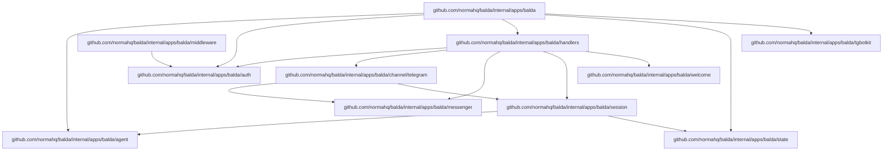

# Norma Balda (V1)

`balda start` is a channel-aware background ACP service that currently binds Telegram chats/topics to ADK agents created by Norma's agent factory.

## Summary

- Runtime stack: `tgbotkit/runtime` + Google ADK runners.
- Telegram is the first supported Balda channel; future channels should be added as top-level config siblings such as `balda.whatsapp`.
- Main agent: Balda app key `balda.provider` (profile overrides via `profiles.<profile>.balda.provider`).
- Subagents: one session per Telegram topic (`message_thread_id`) with dedicated git worktree.
- Balda startup prompt includes workspace settings for each session; in git workspace mode it also includes session/base/current-branch context and workspace MCP guidance.
- Output streaming:
  - Progress updates: non-terminal ADK events emit channel progress. Telegram maps this to throttled Bot API `sendChatAction` with `typing` for all chats, plus throttled DM-only `sendMessageDraft` thinking placeholders.
  - Final assistant response: Telegram Bot API `sendMessage` with `balda.telegram.formatting_mode` (`markdownv2|html|none`; default `markdownv2`).
- Auth model: one-time owner authorization with startup-generated token.

## User Onboarding Reference

The primary onboarding path runs Balda as a single app with no required backing
services. Balda persists local state in SQLite and uses Telegram polling by
default, so first-time setup does not require Redis, Postgres, object storage,
queues, a public URL, or a webhook endpoint.

npm remains the shortest install path:

```bash
npm install -g -y @normahq/balda
balda init
balda start
```

`balda init` requires a Telegram bot token, detects supported provider CLIs
(`codex`, `opencode`, `copilot`, `gemini`, `claude`), writes
`.config/balda/config.yaml`, initializes `.config/balda/state.db`, and prints
both an owner auth command and Telegram auth URL. The default token storage is
CWD `.env` as `BALDA_TELEGRAM_TOKEN`.
To preserve older state, rename `.config/balda/balda.db` to
`.config/balda/state.db` or copy `.config/relay/relay.db` there.

Owner onboarding is completed in a direct message with the bot by opening the
printed auth URL or sending:

```text
/start owner=<owner_token>
```

After owner auth, users can send normal direct messages to the owner session or
create a named topic session:

```text
/topic <name>
```

The supported Docker Compose onboarding path uses the shipped root
`Dockerfile` and `compose.yaml`:

```bash
docker compose build balda
docker compose run --rm balda init
docker compose up -d balda
```

The Compose service bind-mounts the current directory as `/workspace`, so the
container uses the same `.env`, `.config/balda/config.yaml`,
`.config/balda/state.db`, and `.git` as host execution.

## Package Dependencies



### Dependency Summary

| Package | Import Path | Description | Depends On |
|---------|-------------|-------------|------------|
| `balda` | `internal/apps/balda` | Root application module | agent, auth, handlers, state, tgbotkit |
| `agent` | `internal/apps/balda/agent` | Agent builder & workspace manager | `internal/git`, `pkg/runtime/*` |
| `auth` | `internal/apps/balda/auth` | Owner authentication store | state (interface) |
| `channel/telegram` | `internal/apps/balda/channel/telegram` | Telegram message adapter | messenger, session |
| `handlers` | `internal/apps/balda/handlers` | Telegram command handlers | auth, channel/telegram, messenger, session, welcome |
| `messenger` | `internal/apps/balda/messenger` | Telegram message sending | `tgbotkit/client` |
| `middleware` | `internal/apps/balda/middleware` | Auth middleware | auth |
| `session` | `internal/apps/balda/session` | Session management | agent, state |
| `state` | `internal/apps/balda/state` | SQLite state persistence | `modernc.org/sqlite`, `updatepoller` |
| `tgbotkit` | `internal/apps/balda/tgbotkit` | Telegram bot runtime | `tgbotkit/*` |
| `welcome` | `internal/apps/balda/welcome` | Welcome message builder | (standalone) |

## Startup Order (Required)

Balda startup order is strict:

1. Load Norma + balda config.
2. Start internal MCP lifecycle manager.
3. Start Balda provider via `agentfactory.Factory`.
4. Start Telegram runtime receiver.

Internal MCP v1 scope is config + lifecycle plumbing; server implementations can be added incrementally.

## Configuration

Balda config is loaded from one selected file (priority order):

1. Embedded defaults (`cmd/balda/balda.yaml`)
2. Runtime config in `.config/balda/config.yaml`
3. Profile app overrides in the same file (`profiles.<name>.balda.*`)
4. Environment variables (`BALDA_*`) via Viper env mapping

Balda also auto-loads a `.env` file at startup (via `godotenv`) from the Balda process working directory only. Values loaded from `.env` are treated as environment variables, so `BALDA_*` entries override file config the same way as exported shell variables.
The selected config file is env-expanded before YAML parsing, so both `$VAR` and `${VAR}` placeholders work anywhere in that file. For `runtime.mcp_servers.<id>` entries with `type: stdio`, the launched MCP process inherits Balda's full process environment by default, and `env` overrides individual variables.

Example `.env`:

```dotenv
BALDA_TELEGRAM_TOKEN=123456:ABCDEF
BALDA_TELEGRAM_FORMATTING_MODE=markdownv2
BALDA_TELEGRAM_WEBHOOK_ENABLED=true
BALDA_TELEGRAM_WEBHOOK_URL=https://example.com/telegram/webhook
```

Config shape:

```yaml
runtime:
  providers:
    <provider_id>:
      type: <provider_type>
  mcp_servers: {}
balda:
  provider: <provider_id>
  telegram:
    token: ""
    formatting_mode: "markdownv2"
profiles:
  <profile>:
    balda:
      provider: <provider_id>
```

### Docker Compose Runtime

Balda ships a maintained root `Dockerfile` and `compose.yaml` for local Docker
Compose runtime. This image is a local runtime convenience, not the canonical
OSS release artifact. The Compose service builds a local image and mounts the
current project directory as the runtime workspace.

The `Dockerfile` uses a Node Bookworm runtime with the common tools Balda needs:

```dockerfile
ARG NODE_IMAGE=node:24-bookworm
FROM ${NODE_IMAGE}

RUN apt-get update \
 && apt-get install -y --no-install-recommends \
      ca-certificates \
      curl \
      git \
      openssh-client \
      ripgrep \
 && rm -rf /var/lib/apt/lists/*

RUN npm install -g \
      @normahq/balda \
      @openai/codex \
      opencode-ai \
      @google/gemini-cli \
      @anthropic-ai/claude-code \
      @github/copilot \
 && npm cache clean --force

RUN command -v balda \
 && command -v codex \
 && command -v opencode \
 && command -v gemini \
 && command -v claude \
 && command -v copilot

USER node

WORKDIR /workspace
ENTRYPOINT ["balda"]
```

The `compose.yaml` uses a current-directory bind mount:

```yaml
services:
  balda:
    build: .
    working_dir: /workspace
    volumes:
      - .:/workspace
      - balda-home:/home/node
    command: start

volumes:
  balda-home:
```

With `.:/workspace`, Balda resolves the default runtime paths inside the mounted
project:

- `.env` is loaded from `/workspace/.env`.
- `.config/balda/config.yaml` remains the selected app config.
- `.config/balda/state.db` persists owner auth, session metadata, MCP KV, and
  Telegram polling offsets on the host.
- `.config/balda/MEMORY.md` and optional `.config/balda/SOUL.md` stay on the
  host. `MEMORY.md` is used when `balda.memory.enabled=true`; `SOUL.md` is
  always read when present.
- `.git` stays visible to `balda.workspace.mode=auto|on`, so workspace mode sees
  the same repository as host execution.
- `balda-home` persists provider CLI auth/config written under `/home/node`.

Balda auto-loads `/workspace/.env`. `env_file: .env` is optional after the file
exists, but should not be required for the first `docker compose run --rm balda init`.

The container image bundles Balda plus every provider CLI detected by
`balda init`: `codex`, `opencode`, `copilot`, `gemini`, and `claude`. Claude
Code is detected through the real `claude` binary; `claudecode` is not a
supported binary name. Provider credentials are not baked into the image.
Authenticate through provider environment variables or by running provider login
commands through Compose. If you need fully repeatable builds, pin `NODE_IMAGE`
to a digest or concrete supported Bookworm tag, and pin the Dockerfile package
build args to exact npm versions: `BALDA_NPM_PACKAGE`, `CODEX_NPM_PACKAGE`,
`OPENCODE_NPM_PACKAGE`, `GEMINI_NPM_PACKAGE`, `CLAUDE_CODE_NPM_PACKAGE`, and
`COPILOT_NPM_PACKAGE`.

Polling mode is the default and does not require a published port. Webhook mode
requires `balda.telegram.webhook.enabled=true`,
`balda.telegram.webhook.url=https://.../telegram/webhook`, and a published local
listener such as `8080:8080`; TLS and public routing should be handled outside
the Balda process.

### MCP Server Configuration

MCP servers are configured in `runtime.mcp_servers` and referenced by providers via `runtime.providers.<id>.mcp_servers`.

#### Transport Types

| Type | Description |
|------|-------------|
| `stdio` | Process-based stdio communication (recommended for local tools) |
| `http` | HTTP transport with SSE streaming |
| `sse` | Server-Sent Events transport |

#### Stdio MCP Server Example

```yaml
runtime:
  mcp_servers:
    # Local Python tool server
    python-tools:
      type: stdio
      cmd: ["uv", "run", "mcp", "run", "path/to/server.py"]
      env:
        API_KEY: "${PYTHON_TOOLS_API_KEY}"
      working_dir: /path/to/project

    # Node.js based MCP server
    node-tools:
      type: stdio
      cmd: ["npx", "-y", "@modelcontextprotocol/server-filesystem", "/tmp"]
      env:
        DEBUG: "true"
```

#### HTTP MCP Server Example

```yaml
runtime:
  mcp_servers:
    remote-mcp:
      type: http
      url: https://mcp.example.com/mcp
      headers:
        Authorization: "Bearer ${MCP_TOKEN}"
```

#### Using MCP Servers in Providers

```yaml
runtime:
  mcp_servers:
    python-tools:
      type: stdio
      cmd: ["uv", "run", "mcp", "run", "server.py"]

  providers:
    codex:
      type: codex_acp
      mcp_servers:
        - python-tools

balda:
  provider: codex
  mcp_servers: []  # extra servers added to all sessions
```

#### Bundled Balda MCP Server

The balda MCP server (`balda`) is automatically included in all sessions. It provides:

- `balda.state` - persistent key-value storage
- `balda.memory.read` - read `${balda.state_dir}/MEMORY.md` when `balda.memory.enabled=true`
- `balda.memory.remember` - append a durable fact to `${balda.state_dir}/MEMORY.md` when `balda.memory.enabled=true`
- `balda.workspace.import` - import workspace from base branch
- `balda.workspace.export` - export workspace to base branch

`balda.memory.remember` is for explicit user requests such as "remember this".
It updates the file immediately, but running agent sessions keep their existing
session-start snapshot. New or restored sessions read the latest file.

### Telegram settings

- `balda.telegram.token`: bot token (required)
  - `balda init` validates token via Telegram API and can store it either in:
    - CWD `.env` as `BALDA_TELEGRAM_TOKEN` (default)
    - balda config file key `balda.telegram.token`
  - when `.env` storage is selected, existing `.env` content is preserved and `BALDA_TELEGRAM_TOKEN` is upserted
- `balda.telegram.formatting_mode`: final assistant response format mode.
  - allowed values: `markdownv2`, `html`, `none`
  - default: `markdownv2`
  - `markdownv2` accepts normal Markdown/plain text from the model and converts it to Telegram MarkdownV2
  - `html` expects Telegram HTML syntax from the model; Balda escapes unsafe raw text while preserving supported Telegram HTML tags
  - `none` omits Telegram `parse_mode` and sends raw text
  - invalid values fail startup
  - see [Telegram Message Formatting](telegram-formatting.md) for supported tags, unsupported tags, and escaping behavior
- `balda.telegram.plan_updates`: surface ACP plan snapshots in balda progress (default: `true`)
  - `true`: DM chats replace generic thinking drafts with plan snapshots when the provider emits plan updates
  - `true`: public chats/topics send a plain-text message for each distinct plan snapshot
  - `false`: balda keeps legacy progress behavior (`typing` plus DM `Thinking...` drafts)
- `balda.telegram.webhook.enabled`: enable local HTTP webhook endpoint (`true` => webhook mode, `false` => polling mode; default: `false`)
- `balda.telegram.webhook.url`: outgoing Telegram webhook URL (required when `balda.telegram.webhook.enabled=true`)
- `balda.telegram.webhook.auth_token`: webhook auth token required when `balda.telegram.webhook.enabled=true`; Telegram sends it as `X-Telegram-Bot-Api-Secret-Token`
- `balda.telegram.webhook.listen_addr`: local webhook listen address (default: `0.0.0.0:8080`)
- `balda.telegram.webhook.path`: local webhook path (default: `/telegram/webhook`)
- `balda.inbound_webhooks.enabled`: enable generic inbound webhook receiver (default: `false`)
- `balda.inbound_webhooks.listen_addr`: local inbound webhook listen address (default: `127.0.0.1:8090`)
- `balda.inbound_webhooks.routes`: route table keyed by route name
  - required when `balda.inbound_webhooks.enabled=true`
  - each route requires:
    - `path`: local inbound webhook path (for example `/webhook/release`)
    - `report_to`: locator alias key from `balda.locators`
    - `prompt_template`: Go `text/template` rendered with `RequestID`, `Path`, `Method`, `RawBody`, and `Headers`

### Balda settings

- `balda.working_dir`: optional balda working directory (defaults to process CWD)
- `balda.state_dir`: balda state directory for persistent balda SQLite state (`state.db`).
  - Stores owner/app KV, `balda.state` MCP KV, session metadata, optional ADK session history, and Telegram polling offset.
  - Schema is migration-versioned and auto-applied on startup.
  - Relative paths are resolved from `balda.working_dir`.
  - Default: `.config/balda`
- `balda.sessions.persistence`: `sqlite|memory` (default `sqlite`)
  - `sqlite`: ADK session events and state are persisted in `state.db` and reused after restart until `/reset` or explicit `/close`.
  - `memory`: ADK conversation/runtime state is process-local; only Balda metadata is persisted.
- `balda.memory.enabled`: enable internal durable memory (default `true`)
  - when disabled, Balda does not snapshot `MEMORY.md`, register `balda.memory.*` MCP tools, or expose `/memory` contents.
- `balda.goal.max_iterations`: maximum Goalkeeper worker/validator iterations for `/goal` (default `25`)
  - invalid values are clamped to `25`.
- internal durable memory uses `${balda.state_dir}/MEMORY.md` when `balda.memory.enabled=true`
  - `/memory` reads the current file in owner/collaborator direct messages.
  - `balda.memory.read` reads the file from MCP.
  - `balda.memory.remember` appends facts to the file from MCP.
  - memory is snapshotted into ADK session state when a session starts or restores; active sessions are not refreshed after writes.
- optional session-start operator instructions use `${balda.state_dir}/SOUL.md`
  - Balda reads the file on session start/restore when it exists; this is independent from `balda.memory.enabled`.
  - Balda does not expose MCP mutation for `SOUL.md`; edit the file directly.
- owner auth token is generated during `balda init`, persisted in `state.db`, and reused by `balda start`
  - if token is missing in existing state, `balda start` backfills one-time and persists it
  - if no owner is registered yet, `balda start` logs the owner bootstrap command and deeplink again to help finish first-time onboarding
  - after the first successful owner auth, normal startup logs go back to bot identity only and no longer expose owner auth tokens or auth URLs
  - if an owner is already registered, `balda start` fails fast when the owner session cannot be restored or created
- bundled balda MCP listener always binds to local ephemeral address (`127.0.0.1:0`)
  - bundled routes on this listener:
    - `/mcp` and `/mcp/balda` for the built-in balda MCP server
- Balda config is edited via the config file itself, not through MCP.
  - balda agents should use the config path shown in the system instruction and edit `.config/balda/config.yaml` directly
- `balda.mcp_servers`: extra MCP server IDs for all balda-started sessions (must reference IDs declared in `runtime.mcp_servers`)
  - effective MCP IDs = bundled defaults + `runtime.providers.<provider_id>.mcp_servers` + `balda.mcp_servers` (deduplicated)
- `balda.global_instruction`: optional balda-wide global instruction applied to all sessions
  - value: global instruction text included in balda prompt for all agents
  - effective balda instruction order: built-in balda instructions + `balda.global_instruction` + `runtime.providers.<provider_id>.system_instructions`
  - `balda init` generates a channel-aware example prompt
- `balda.workspace.mode`: `on|off|auto` (default `auto`)
  - `on`: always use Git worktrees per session; startup fails if `working_dir` is not a Git repository
  - `off`: run agents directly in balda `working_dir` (no `balda.workspace` namespace)
  - `auto`: enable worktrees only when `working_dir` is a Git repo, otherwise fallback to `off`
- `balda.workspace.base_branch`: base branch used for workspace sync/export (for example `main`, `master`, `develop`)
  - `balda init` detects current HEAD branch and writes it when available
  - if empty, balda resolves base branch from current HEAD at startup
  - `balda.workspace.export` requires main repo to be on this branch
- Balda is Beads-independent by default and does not auto-start bundled `norma.tasks` MCP.

## Session Model

Session key:

- Owner session: owner DM `(chat_id, topic_id=0)`
- Regular session: any other channel address `(chat_id, topic_id)`, including public `topic_id=0`
- Canonical Balda session IDs are channel-scoped. Telegram uses `tg-<chat_id>-<topic_id>`.
- The owner session is bootstrapped for the bound owner DM chat (`topic_id=0`) during activation/startup when an owner is already registered.

Balda always persists session metadata in `state.db` for lazy restore.
By default, Balda also persists ADK session events and state in `state.db` until `/reset` or explicit `/close`. Set `balda.sessions.persistence=memory` to keep ADK conversation/runtime state process-local while retaining Balda session metadata for lazy restore.

## Message Flow

1. User sends Telegram message.
   - In non-DM chats (groups/supergroups/topics), Balda processes a message when it contains a mention entity for `@<bot_username>` or is a reply to this bot's message.
   - For mention-triggered messages that are replies, balda forwards replied message `text` (fallback `caption`) as model context.
   - In DM chats, Balda processes non-command text messages normally.
2. Balda resolves session by `(chat_id, topic_id)`.
3. If the session is missing in memory, balda attempts lazy restore from persisted metadata.
4. Balda calls ADK runner for that session.
5. Balda streams non-terminal ADK event progress to Telegram via chat actions (and DM thinking draft updates).

## Telegram Messaging Behavior

Per model turn:

1. Non-terminal ADK events send throttled `sendChatAction` with `typing` for the same chat/topic; DM chats also emit throttled plain `sendMessageDraft` thinking placeholders using a stable `draft_id`.
   When `balda.telegram.plan_updates=true`, ACP plan snapshots replace generic DM thinking drafts and are sent as plain-text progress messages in public chats/topics.
2. Final assistant text is sent with `sendMessage` using `balda.telegram.formatting_mode`:
   - `markdownv2`: model writes Markdown/plain text; Balda converts it to Telegram MarkdownV2 and sends with `parse_mode=MarkdownV2`.
   - `html`: model writes Telegram HTML; Balda escapes unsafe raw text, preserves supported Telegram HTML tags, and sends with `parse_mode=HTML`.
   - `none`: Balda sends text without `parse_mode`.
3. If send fails at transport level, or Telegram returns parse/escaping API errors (for example `can't parse entities`), balda retries once without `parse_mode`.

## Topic Sessions

Balda runs with a single provider per process (`balda.provider`).

- The provider is initialized before message handling.
- The owner session (`topic_id=0` in the owner DM) is bootstrapped for the owner chat during activation.
- On restart, the owner session follows the same restore path as regular sessions: restore persisted metadata first, then fall back to fresh create only when no persisted record exists.
- Every regular channel address maps to its own ADK session, including public main-chat `topic_id=0`, but all sessions in that balda instance use the same provider runtime.

### Manual session control

- `/topic <name>` (DM only, owner/collaborator): creates a new Telegram topic and a topic-bound session.
  - `<name>` is required.
  - `<name>` is a session label, not a provider selector.
- `/goal <objective>` (owner/collaborator): starts a Goalkeeper worker -> validator loop in the current session context/workspace and posts started/validation/final updates using `balda.telegram.formatting_mode`. See [`docs/goalkeeper.md`](goalkeeper.md).
  - concurrent `/goal` runs in the same session are rejected.
- `/close` (DM only, owner/collaborator): resets current session history, then in the owner DM `topic_id=0` stops the owner session; in topic contexts, closes that topic.
- `/reset` (owner/collaborator): cancels queued work and clears the current session's persisted ADK conversation history without deleting Balda metadata or the workspace branch.
- `/cancel` (owner/collaborator): cancels active turn, drops queued turns, and aborts active `/goal` run for current session.
- `/memory` (DM only, owner/collaborator): prints current `${balda.state_dir}/MEMORY.md` contents when `balda.memory.enabled=true`; otherwise reports that memory is disabled.

### Scheduled job runtime semantics (internal)

Balda includes an internal locator-targeted scheduler backed by `balda_scheduled_jobs`.
Jobs are managed from config on startup using `balda.locators` and `balda.scheduler.jobs`.

- Eligibility: only `status=active` jobs with `next_run_at <= now` are polled.
- Dispatch path: due jobs resolve a session by canonical locator (`channel_type`, `address_key`, `address_json`, `session_id`) and enqueue a turn through the same per-session `TurnDispatcher` path as normal messages.
- Idempotency key: each due slot uses deterministic `last_dispatch_key = <job_id>@<due_next_run_at_rfc3339nano>`.
- Startup reconciliation: configured job IDs are upserted, and persisted jobs not present in config are removed.
- Claim-before-run: scheduler writes `last_dispatch_key` and advances `next_run_at` to the next cron occurrence before enqueueing work, so stale duplicate due reads do not enqueue the same due slot twice.
- Success: `last_run_at` is updated, `last_error` is cleared, `retry_count` is reset to `0`, and job remains `active`.
- Failure: `retry_count` increments and `last_error` is recorded.
  - if `retry_count <= max_retries`: job stays `active`, `next_run_at = now + retryDelay(retry_count)`.
  - if `retry_count > max_retries`: job is moved to `paused` and will not be dispatched until reactivated.
- Retry delay policy: linear backoff in seconds (`1s`, `2s`, `3s`, ...) capped at `60s`.

### Inbound webhook contract (internal)

Balda can optionally expose local webhook routes that map path -> locator alias -> prompt template.

- Endpoint config: `balda.inbound_webhooks.enabled`, `listen_addr`, `routes`.
- Method: `POST` only.
- Route resolution:
  - request path must match a configured route `path`
  - each route defines `report_to` (locator alias in `balda.locators`)
  - session target is resolved from alias, not from request payload
- Prompt generation:
  - request body is treated as opaque raw text
  - route `prompt_template` is rendered with `RequestID`, `Path`, `Method`, `RawBody`, `Headers`
  - rendered prompt must be non-empty
- Session resolution:
  - looks up active session by configured locator
  - lazily restores persisted session when inactive in memory
  - enqueues through the same per-session `TurnDispatcher` + `runTurnTask` path as Telegram messages
- Response model (JSON):
  - accepted: `202` with `{status:"accepted", request_id, session_id, queue_position}`
  - route not found: `404` + `error.code="route_not_found"`
  - invalid method: `405` + `error.code="invalid_method"`
  - invalid body/template render: `400` + `error.code="invalid_payload"`
  - unresolved/restore-failed session: `404` + `error.code="session_not_found"`
  - queue pressure: `429` + `error.code="queue_full"`
  - dispatch/internal failures: `500` + `error.code="dispatch_failed"`
- Observability:
  - logs include stable fields: `request_id`, `session_id`, `channel_type`, `address_key`, `queue_position`, `status_code`, `error_code`
  - internal outcome counters track accepted, invalid, not-found, queue-full, and dispatch-failure events

### Session restore/create behavior

- Balda restores persisted session metadata on first message after restart.
- When `balda.sessions.persistence=sqlite`, restore reuses the stable ADK session ID and prior ADK event/state history.
- Persisted session label is reused as-is for restore; if missing, balda falls back to label `auto`.
- In workspace mode, restore first tries to sync the session branch with the configured base branch.
- If that sync conflicts, balda recreates a clean worktree on the persisted session branch, restores the session anyway, and sends a short warning that `balda.workspace.import` can retry the sync later.
- If no persisted session metadata exists, balda creates a new regular session using label `auto`.
- Public-channel welcome banners always display `Name: balda` to keep app identity stable, even when the internal persisted session label differs.
- Welcome message uses a user-friendly MarkdownV2 format:
  - Example:
    🚀 **Session Started** • **Name:** `balda` • **ID:** `tg-1-0` • **Model:** `opencode/big-pickle` • **Type:** `opencode_acp` • **MCP:** `balda`

## Workspace MCP Usage

- `balda.workspace.import`
  - rebases the session workspace onto the configured base branch
  - works for active or persisted sessions as long as workspace metadata exists in `state.db`
  - is the explicit retry path when restart restore skipped base sync because of a conflict
- `balda.workspace.export`
  - squash-merges the session workspace branch into the configured base branch with the provided Conventional Commit message
  - also works for persisted sessions before lazy restore

## Acceptance/Verification Scenarios

1. Startup order enforces internal MCP -> Balda provider -> bot runtime.
2. Polling mode starts by default when `balda.telegram.webhook.enabled=false`.
3. Webhook mode (`balda.telegram.webhook.enabled=true`) fails fast without `balda.telegram.webhook.url` or `balda.telegram.webhook.auth_token`.
4. `/start owner=<token>` registers owner once; `/start invite=<token>` onboards collaborators; non-owner traffic is otherwise rejected.
5. `/topic <name>` creates topic + Balda session and persists session metadata.
6. `/topic` without name returns usage error.
7. Restart clears active process sessions, but topic sessions are lazy-restored from persisted metadata.
8. Polling mode resumes from persisted Telegram offset in balda state DB.
9. Non-terminal ADK event progress sends throttled `typing` chat actions in DM and public chats; throttled `sendMessageDraft` thinking placeholders are DM-only.
10. Final assistant response is sent with `sendMessage` using configured `balda.telegram.formatting_mode` with fallback retry without `parse_mode` on transport or parse/escaping API errors.
11. `/close` in a topic resets history and closes that topic; `/close` in the owner DM main chat resets only the owner session.
12. With `balda.sessions.persistence=sqlite`, restart restores ADK conversation history and `/reset` or explicit `/close` clears it for the current session.
