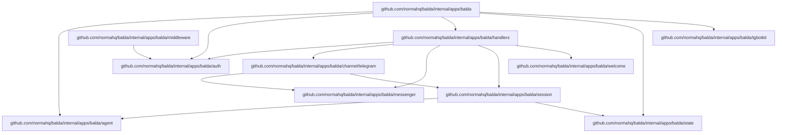
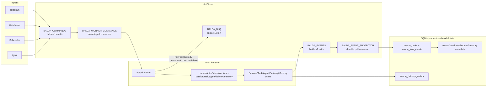

# Norma Balda (V1)

`balda start` is a channel-aware background ACP service that currently binds Telegram chats/topics to ADK agents created by Norma's agent factory.

Architecture contracts and migration execution documents are maintained in:

- `docs/architecture/index.md`
- `docs/exec-plans/active/jetstream-hard-cutover.md`
- `docs/tech-debt/jetstream-migration-debt.md`

## Summary

- Runtime stack: `tgbotkit/runtime` + Google ADK runners.
- Telegram is the first supported Balda channel; future channels should be added as top-level config siblings such as `balda.whatsapp`.
- Main agent: Balda app key `balda.provider` (profile overrides via `profiles.<profile>.balda.provider`).
- Subagents: one session per Telegram topic (`message_thread_id`) with dedicated git worktree.
- Balda startup prompt includes workspace settings for each session; in git workspace mode it also includes session/base/current-branch context and workspace MCP guidance.
- Output streaming:
  - Progress updates: non-terminal ADK events emit channel progress. Telegram maps this to throttled Bot API `sendChatAction` with `typing` for all chats, plus throttled DM-only `sendMessageDraft` thinking placeholders.
  - Final assistant response: Telegram Bot API `sendMessage` with `balda.telegram.formatting_mode` (`markdownv2|html|none`; default `markdownv2`).
- Auth model: one-time owner authorization with startup-generated token.

## User Onboarding Reference

The primary onboarding path runs Balda as a single app with embedded JetStream
and local SQLite state. JetStream is mandatory for command/event transport, but
it is bundled inside the Balda process by default, so first-time setup still
does not require operating an external queue service.

SQLite remains product/read-model state (owner/collaborator, session metadata,
task views, memory state, scheduler metadata, delivery outbox), not a command
queue.

npm remains the shortest install path:

```bash
npm install -g -y @normahq/balda
balda init
balda start
```

`balda init` requires a Telegram bot token, detects supported provider CLIs
(`codex`, `opencode`, `copilot`, `gemini`, `claude`), writes
`.config/balda/config.yaml`, initializes `.config/balda/state.db`, and prints
both an owner auth command and Telegram auth URL. The default token storage is
CWD `.env` as `BALDA_TELEGRAM_TOKEN`.
To preserve older state, rename `.config/balda/balda.db` to
`.config/balda/state.db` or copy `.config/relay/relay.db` there.

Owner onboarding is completed in a direct message with the bot by opening the
printed auth URL or sending:

```text
/start owner=<owner_token>
```

After owner auth, users can send normal direct messages to the owner session or
create a named topic session:

```text
/topic <name>
```

The supported Docker Compose onboarding path uses the shipped root
`Dockerfile` and `compose.yaml`:

```bash
docker compose build balda
docker compose run --rm balda init
docker compose up -d balda
```

The Compose service bind-mounts the current directory as `/workspace`, so the
container uses the same `.env`, `.config/balda/config.yaml`,
`.config/balda/state.db`, and `.git` as host execution.

## Package Dependencies



### Dependency Summary

| Package | Import Path | Description | Depends On |
|---------|-------------|-------------|------------|
| `balda` | `internal/apps/balda` | Root application module | agent, auth, handlers, state, tgbotkit |
| `agent` | `internal/apps/balda/agent` | Agent builder & workspace manager | `internal/git`, `pkg/runtime/*` |
| `auth` | `internal/apps/balda/auth` | Owner authentication store | state (interface) |
| `channel/telegram` | `internal/apps/balda/channel/telegram` | Telegram message adapter | messenger, session |
| `handlers` | `internal/apps/balda/handlers` | Telegram command handlers | auth, channel/telegram, messenger, session, welcome |
| `messenger` | `internal/apps/balda/messenger` | Telegram message sending | `tgbotkit/client` |
| `middleware` | `internal/apps/balda/middleware` | Auth middleware | auth |
| `session` | `internal/apps/balda/session` | Session management | agent, state |
| `state` | `internal/apps/balda/state` | SQLite state persistence | `modernc.org/sqlite`, `updatepoller` |
| `tgbotkit` | `internal/apps/balda/tgbotkit` | Telegram bot runtime | `tgbotkit/*` |
| `welcome` | `internal/apps/balda/welcome` | Welcome message builder | (standalone) |

## Startup Order (Required)

Balda startup order is strict:

1. Load Norma + balda config.
2. Start internal MCP lifecycle manager.
3. Start Balda provider via `agentfactory.Factory`.
4. Start Telegram runtime receiver.

Internal MCP v1 scope is config + lifecycle plumbing; server implementations can be added incrementally.

## Configuration

Balda config is loaded from one selected file (priority order):

1. Embedded defaults (`cmd/balda/balda.yaml`)
2. Runtime config in `.config/balda/config.yaml`
3. Profile app overrides in the same file (`profiles.<name>.balda.*`)
4. Environment variables (`BALDA_*`) via Viper env mapping

Balda also auto-loads a `.env` file at startup (via `godotenv`) from the Balda process working directory only. Values loaded from `.env` are treated as environment variables, so `BALDA_*` entries override file config the same way as exported shell variables.
The selected config file is env-expanded before YAML parsing, so both `$VAR` and `${VAR}` placeholders work anywhere in that file. For `runtime.mcp_servers.<id>` entries with `type: stdio`, the launched MCP process inherits Balda's full process environment by default, and `env` overrides individual variables.

Example `.env`:

```dotenv
BALDA_TELEGRAM_TOKEN=123456:ABCDEF
BALDA_TELEGRAM_FORMATTING_MODE=markdownv2
BALDA_TELEGRAM_WEBHOOK_ENABLED=true
BALDA_TELEGRAM_WEBHOOK_URL=https://example.com/telegram/webhook
```

Config shape:

```yaml
runtime:
  providers:
    <provider_id>:
      type: <provider_type>
  mcp_servers: {}
balda:
  provider: <provider_id>
  telegram:
    token: ""
    formatting_mode: "markdownv2"
profiles:
  <profile>:
    balda:
      provider: <provider_id>
```

### Docker Compose Runtime

Balda ships a maintained root `Dockerfile` and `compose.yaml` for local Docker
Compose runtime. This image is a local runtime convenience, not the canonical
OSS release artifact. The Compose service builds a local image and mounts the
current project directory as the runtime workspace.

The `Dockerfile` uses a Node Bookworm runtime with the common tools Balda needs:

```dockerfile
ARG NODE_IMAGE=node:24-bookworm
FROM ${NODE_IMAGE}

RUN apt-get update \
 && apt-get install -y --no-install-recommends \
      ca-certificates \
      curl \
      git \
      openssh-client \
      ripgrep \
 && rm -rf /var/lib/apt/lists/*

RUN npm install -g \
      @normahq/balda \
      @openai/codex \
      opencode-ai \
      @google/gemini-cli \
      @anthropic-ai/claude-code \
      @github/copilot \
 && npm cache clean --force

RUN command -v balda \
 && command -v codex \
 && command -v opencode \
 && command -v gemini \
 && command -v claude \
 && command -v copilot

USER node

WORKDIR /workspace
ENTRYPOINT ["balda"]
```

The `compose.yaml` uses a current-directory bind mount:

```yaml
services:
  balda:
    build: .
    working_dir: /workspace
    volumes:
      - .:/workspace
      - balda-home:/home/node
    command: start

volumes:
  balda-home:
```

With `.:/workspace`, Balda resolves the default runtime paths inside the mounted
project:

- `.env` is loaded from `/workspace/.env`.
- `.config/balda/config.yaml` remains the selected app config.
- `.config/balda/state.db` persists owner auth, session metadata, task
  read-model state, MCP KV, and Telegram polling offsets on the host.
- `.config/balda/MEMORY.md` and optional `.config/balda/SOUL.md` stay on the
  host. `MEMORY.md` is used when `balda.memory.enabled=true`; `SOUL.md` is
  always read when present.
- `.git` stays visible to `balda.workspace.mode=auto|on`, so workspace mode sees
  the same repository as host execution.
- `balda-home` persists provider CLI auth/config written under `/home/node`.

Balda auto-loads `/workspace/.env`. `env_file: .env` is optional after the file
exists, but should not be required for the first `docker compose run --rm balda init`.

The container image bundles Balda plus every provider CLI detected by
`balda init`: `codex`, `opencode`, `copilot`, `gemini`, and `claude`. Claude
Code is detected through the real `claude` binary; `claudecode` is not a
supported binary name. Provider credentials are not baked into the image.
Authenticate through provider environment variables or by running provider login
commands through Compose. If you need fully repeatable builds, pin `NODE_IMAGE`
to a digest or concrete supported Bookworm tag, and pin the Dockerfile package
build args to exact npm versions: `BALDA_NPM_PACKAGE`, `CODEX_NPM_PACKAGE`,
`OPENCODE_NPM_PACKAGE`, `GEMINI_NPM_PACKAGE`, `CLAUDE_CODE_NPM_PACKAGE`, and
`COPILOT_NPM_PACKAGE`.

Polling mode is the default and does not require a published port. Webhook mode
requires `balda.telegram.webhook.enabled=true`,
`balda.telegram.webhook.url=https://.../telegram/webhook`, and a published local
listener such as `8080:8080`; TLS and public routing should be handled outside
the Balda process.

### MCP Server Configuration

MCP servers are configured in `runtime.mcp_servers` and referenced by providers via `runtime.providers.<id>.mcp_servers`.

#### Transport Types

| Type | Description |
|------|-------------|
| `stdio` | Process-based stdio communication (recommended for local tools) |
| `http` | HTTP transport with SSE streaming |
| `sse` | Server-Sent Events transport |

#### Stdio MCP Server Example

```yaml
runtime:
  mcp_servers:
    # Local Python tool server
    python-tools:
      type: stdio
      cmd: ["uv", "run", "mcp", "run", "path/to/server.py"]
      env:
        API_KEY: "${PYTHON_TOOLS_API_KEY}"
      working_dir: /path/to/project

    # Node.js based MCP server
    node-tools:
      type: stdio
      cmd: ["npx", "-y", "@modelcontextprotocol/server-filesystem", "/tmp"]
      env:
        DEBUG: "true"
```

#### HTTP MCP Server Example

```yaml
runtime:
  mcp_servers:
    remote-mcp:
      type: http
      url: https://mcp.example.com/mcp
      headers:
        Authorization: "Bearer ${MCP_TOKEN}"
```

#### Using MCP Servers in Providers

```yaml
runtime:
  mcp_servers:
    python-tools:
      type: stdio
      cmd: ["uv", "run", "mcp", "run", "server.py"]

  providers:
    codex:
      type: codex_acp
      mcp_servers:
        - python-tools

balda:
  provider: codex
  mcp_servers: []  # extra servers added to all sessions
```

#### Bundled Balda MCP Server

The balda MCP server (`balda`) is automatically included in all sessions. It provides:

- `balda.state` - persistent key-value storage
- `balda.memory.read` - read `${balda.state_dir}/MEMORY.md` when `balda.memory.enabled=true`
- `balda.memory.remember` - append a durable fact to `${balda.state_dir}/MEMORY.md` when `balda.memory.enabled=true`
- `balda.workspace.import` - import workspace from base branch
- `balda.workspace.export` - export workspace to base branch

`balda.memory.remember` is for explicit user requests such as "remember this".
It updates the file immediately, but running agent sessions keep their existing
session-start snapshot. New or restored sessions read the latest file.

### Telegram settings

- `balda.telegram.token`: bot token (required)
  - `balda init` validates token via Telegram API and can store it either in:
    - CWD `.env` as `BALDA_TELEGRAM_TOKEN` (default)
    - balda config file key `balda.telegram.token`
  - when `.env` storage is selected, existing `.env` content is preserved and `BALDA_TELEGRAM_TOKEN` is upserted
- `balda.telegram.formatting_mode`: final assistant response format mode.
  - allowed values: `markdownv2`, `html`, `none`
  - default: `markdownv2`
  - `markdownv2` accepts normal Markdown/plain text from the model and converts it to Telegram MarkdownV2
  - `html` expects Telegram HTML syntax from the model; Balda escapes unsafe raw text while preserving supported Telegram HTML tags
  - `none` omits Telegram `parse_mode` and sends raw text
  - invalid values fail startup
  - see [Telegram Message Formatting](telegram-formatting.md) for supported tags, unsupported tags, and escaping behavior
- `balda.telegram.plan_updates`: surface ACP plan snapshots in balda progress (default: `true`)
  - `true`: DM chats replace generic thinking drafts with plan snapshots when the provider emits plan updates
  - `true`: public chats/topics send a plain-text message for each distinct plan snapshot
  - `false`: balda keeps legacy progress behavior (`typing` plus DM `Thinking...` drafts)
- `balda.telegram.webhook.enabled`: enable local HTTP webhook endpoint (`true` => webhook mode, `false` => polling mode; default: `false`)
- `balda.telegram.webhook.url`: outgoing Telegram webhook URL (required when `balda.telegram.webhook.enabled=true`)
- `balda.telegram.webhook.auth_token`: webhook auth token required when `balda.telegram.webhook.enabled=true`; Telegram sends it as `X-Telegram-Bot-Api-Secret-Token`
- `balda.telegram.webhook.listen_addr`: local webhook listen address (default: `0.0.0.0:8080`)
- `balda.telegram.webhook.path`: local webhook path (default: `/telegram/webhook`)
- `balda.webhooks.enabled`: enable generic inbound webhook receiver (default: `false`)
- `balda.webhooks.listen_addr`: local inbound webhook listen address (default: `127.0.0.1:8090`)
- `balda.webhooks.routes`: route table keyed by route name
  - required when `balda.webhooks.enabled=true`
  - each route requires:
    - `path`: local inbound webhook path (for example `/webhook/release`)
    - `prompt_template`: Go `text/template` rendered with `RequestID`, `Path`, `Method`, `RawBody`, and `Headers`
  - optional `envelope`:
    - `target` + `key`: destination address (defaults to `alias` + `owner`)
    - `mode`: `task` (default) or `session`
    - `report_to`: optional destination for progress/final replies
  - optional `auth`:
    - `type`: `none` (default) or `header`
    - `header` + `value` (or `secret_env`) for `type=header`
  - optional `dedupe`:
    - `source`: `request_id` (default), `header`, or `body_sha256`
    - `header` required for `source=header`

### Balda settings

- `balda.working_dir`: optional balda working directory (defaults to process CWD)
- `balda.state_dir`: balda state directory for persistent balda SQLite state (`state.db`).
  - Stores owner/app KV, `balda.state` MCP KV, session metadata, task/read-model state, optional ADK session history, and Telegram polling offset.
  - Schema is migration-versioned and auto-applied on startup.
  - Goose `goose_db_version` is the migration version authority. Legacy imported
    databases may still contain `schema_migrations`, but balda does not use it
    for migration control.
  - Relative paths are resolved from `balda.working_dir`.
  - Default: `.config/balda`
- `balda.sessions.persistence`: `sqlite|memory` (default `sqlite`)
  - `sqlite`: ADK session events and state are persisted in `state.db` and reused after restart until `/reset` or explicit `/close`.
  - `memory`: ADK conversation/runtime state is process-local; only Balda metadata is persisted.
- `balda.memory.enabled`: enable internal durable memory (default `true`)
  - when disabled, Balda does not snapshot `MEMORY.md`, register `balda.memory.*` MCP tools, or expose `/memory` contents.
- `balda.goal.max_iterations`: maximum Goalkeeper worker/validator iterations for `/goal` (default `25`)
  - invalid values are clamped to `25`.
- `balda.nats.embedded`: run Balda-owned NATS inside the process (default `true`)
- `balda.nats.host` / `port`: embedded listener address (default `127.0.0.1:-1`, random local port)
- `balda.nats.jetstream`: JetStream is required and forced on startup.
- `balda.nats.store_dir`: JetStream store directory, relative to `balda.working_dir` when not absolute (default `.balda/nats`)
- `balda.nats.max_memory` / `max_store`: embedded JetStream resource caps (defaults `256mb` and `2gb`)
- legacy runtime keys are rejected on startup (`balda.event_bus.*`, `balda.swarm.mode`, `balda.webhooks.mode`, `balda.scheduler.mode`)
- `balda.swarm.enabled`: enables the actor runtime and event projector (default `true`). When false, Balda still starts but ingress that requires swarm returns runtime unavailable; there is no direct execution fallback.
- `balda.swarm.commands.stream`: command stream name (default `BALDA_COMMANDS`)
- `balda.swarm.commands.consumer`: durable worker consumer name (default `BALDA_WORKER_COMMANDS`)
- `balda.swarm.commands.ack_wait`, `max_deliver`, `max_ack_pending`, `fetch_batch`, `fetch_wait`: pull-consumer and redelivery settings.
- `balda.swarm.events.stream`: event stream name (default `BALDA_EVENTS`)
- `balda.swarm.dlq.stream`: dead-letter stream name (default `BALDA_DLQ`)
- Actor-lane queue policy is not a public config surface yet; JetStream is the only command queue. SessionActor currently honors only the internal per-envelope `queue_mode=interrupt` control hint.
- `balda.swarm.agents`: logical single-process swarm agents used by the allocator. Defaults are:
  - `planner`: plans work and splits it into subtasks.
  - `executor`: uses project tools and makes changes; advisory tools `workspace`, `shell`, `mcp`.
  - `reviewer`: validates results and inspects risks; advisory tools `workspace`, `shell`.
  - `memory`: extracts durable facts and summaries; advisory tool `memory`.
  Tools are routing/prompt hints only; optional `cost_penalty` lowers allocator preference for expensive roles. All logical agents still use the configured Balda provider runtime in the first release.
  Shell/tool execution policy contract:
  - `planner`: `shell_policy=none`
  - `executor`: `shell_policy=workspace_write`
  - `reviewer`: `shell_policy=read_only`
  - `memory`: `shell_policy=none`
  - custom agents derive shell policy from tools: `shell+workspace -> workspace_write`, `shell only -> read_only`, no shell -> `none`.
  - `/actors status` and `/swarm status` expose each configured actor role with `shell_policy=...`.
- internal durable memory uses `${balda.state_dir}/MEMORY.md` when `balda.memory.enabled=true`
  - `/memory` reads the current file in owner/collaborator direct messages.
  - `balda.memory.read` reads the file from MCP.
  - `balda.memory.remember` appends facts to the file from MCP.
  - memory is snapshotted into ADK session state when a session starts or restores; active sessions are not refreshed after writes.
- optional session-start operator instructions use `${balda.state_dir}/SOUL.md`
  - Balda reads the file on session start/restore when it exists; this is independent from `balda.memory.enabled`.
  - Balda does not expose MCP mutation for `SOUL.md`; edit the file directly.
- owner auth token is generated during `balda init`, persisted in `state.db`, and reused by `balda start`
  - if token is missing in existing state, `balda start` backfills one-time and persists it
  - if no owner is registered yet, `balda start` logs the owner bootstrap command and deeplink again to help finish first-time onboarding
  - after the first successful owner auth, normal startup logs go back to bot identity only and no longer expose owner auth tokens or auth URLs
  - if an owner is already registered, `balda start` fails fast when the owner session cannot be restored or created
- bundled balda MCP listener always binds to local ephemeral address (`127.0.0.1:0`)
  - bundled routes on this listener:
    - `/mcp` and `/mcp/balda` for the built-in balda MCP server
- Balda config is edited via the config file itself, not through MCP.
  - balda agents should use the config path shown in the system instruction and edit `.config/balda/config.yaml` directly
- `balda.mcp_servers`: extra MCP server IDs for all balda-started sessions (must reference IDs declared in `runtime.mcp_servers`)
  - effective MCP IDs = bundled defaults + `runtime.providers.<provider_id>.mcp_servers` + `balda.mcp_servers` (deduplicated)
- `balda.global_instruction`: optional balda-wide global instruction applied to all sessions
  - value: global instruction text included in balda prompt for all agents
  - effective balda instruction order: built-in balda instructions + `balda.global_instruction` + `runtime.providers.<provider_id>.system_instructions`
  - `balda init` generates a channel-aware example prompt
- `balda.workspace.mode`: `on|off|auto` (default `auto`)
  - `on`: always use Git worktrees per session; startup fails if `working_dir` is not a Git repository
  - `off`: run agents directly in balda `working_dir` (no `balda.workspace` namespace)
  - `auto`: enable worktrees only when `working_dir` is a Git repo, otherwise fallback to `off`
- `balda.workspace.base_branch`: base branch used for workspace sync/export (for example `main`, `master`, `develop`)
  - `balda init` detects current HEAD branch and writes it when available
  - if empty, balda resolves base branch from current HEAD at startup
  - `balda.workspace.export` requires main repo to be on this branch
- Balda is Beads-independent by default and does not auto-start bundled `norma.tasks` MCP.

## Session Model

Session key:

- Owner session: owner DM `(chat_id, topic_id=0)`
- Regular session: any other channel address `(chat_id, topic_id)`, including public `topic_id=0`
- Canonical Balda session IDs are channel-scoped. Telegram uses `tg-<chat_id>-<topic_id>`.
- The owner session is bootstrapped for the bound owner DM chat (`topic_id=0`) during activation/startup when an owner is already registered.

Balda always persists session metadata in `state.db` for lazy restore.
By default, Balda also persists ADK session events and state in `state.db` until `/reset` or explicit `/close`. Set `balda.sessions.persistence=memory` to keep ADK conversation/runtime state process-local while retaining Balda session metadata for lazy restore.

## Message Flow

1. User sends Telegram message.
   - In non-DM chats (groups/supergroups/topics), Balda processes a message when it contains a mention entity for `@<bot_username>` or is a reply to this bot's message.
   - For processed replies, balda forwards replied message `text` (fallback `caption`) as model context, plus the new user message when present.
   - In DM chats, Balda processes non-command text messages normally and preserves reply context for reply messages.
2. Balda resolves session by `(chat_id, topic_id)`.
3. If the session is missing in memory, balda attempts lazy restore from persisted metadata.
4. Balda calls ADK runner for that session.
5. Balda streams non-terminal ADK event progress to Telegram via chat actions (and DM thinking draft updates).

## Telegram Messaging Behavior

Per model turn:

1. Non-terminal ADK events send throttled `sendChatAction` with `typing` for the same chat/topic; DM chats also emit throttled plain `sendMessageDraft` thinking placeholders using a stable `draft_id`.
   When `balda.telegram.plan_updates=true`, ACP plan snapshots replace generic DM thinking drafts and are sent as plain-text progress messages in public chats/topics.
2. Final assistant text is sent with `sendMessage` using `balda.telegram.formatting_mode`:
   - `markdownv2`: model writes Markdown/plain text; Balda converts it to Telegram MarkdownV2 and sends with `parse_mode=MarkdownV2`.
   - `html`: model writes Telegram HTML; Balda escapes unsafe raw text, preserves supported Telegram HTML tags, and sends with `parse_mode=HTML`.
   - `none`: Balda sends text without `parse_mode`.
3. If send fails at transport level, or Telegram returns parse/escaping API errors (for example `can't parse entities`), balda retries once without `parse_mode`.

## Topic Sessions

Balda runs with a single provider per process (`balda.provider`).

- The provider is initialized before message handling.
- The owner session (`topic_id=0` in the owner DM) is bootstrapped for the owner chat during activation.
- On restart, the owner session follows the same restore path as regular sessions: restore persisted metadata first, then fall back to fresh create only when no persisted record exists.
- Every regular channel address maps to its own ADK session, including public main-chat `topic_id=0`, but all sessions in that balda instance use the same provider runtime.

### Manual session control

- `/topic <name>` (DM only, owner/collaborator): creates a new Telegram topic and a topic-bound session.
  - `<name>` is required.
  - `<name>` is a session label, not a provider selector.
- `/goal <objective>` (owner/collaborator): publishes a durable JetStream task command and starts work in the current session context/workspace through TaskActor -> AgentActor planner/executor/reviewer -> DeliveryActor. Started/validation/final updates use `balda.telegram.formatting_mode`; terminal updates include Result, Artifacts, Confidence, and Next action sections. See [`docs/goalkeeper.md`](goalkeeper.md).
  - concurrent `/goal` runs in the same session are rejected.
- `/tasks` (owner/collaborator): lists active task records for the current session.
- `/task <id>` (owner/collaborator): shows task status, objective, source, timestamps, latest events, and the reviewable outcome when the task is terminal.
- `/task <id> events` (owner/collaborator): prints the append-only task event stream.
- `/task <id> cancel` (owner/collaborator): publishes a durable task-control command; ControlActor cancels active local task work when present and marks the task `canceled` when the command is processed.
- `/swarm status` (owner/collaborator): shows JetStream command/event/DLQ streams, worker and projector consumer state, configured logical agents, task status counts, and derived queue health metrics (backlog, redelivery, DLQ, projection lag).
- `/queue status` (owner/collaborator): preferred JetStream queue/runtime status command.
- `/mailbox status` (owner/collaborator): compatibility alias for `/queue status`.
- `/dlq` (owner/collaborator): shows JetStream DLQ stream backlog summary.
- `/projection status` (owner/collaborator): shows event-projector lag and projection health summary.
- `/actors status` (owner/collaborator): shows configured logical agent roles/toolsets.
- `/close` (DM only, owner/collaborator): resets current session history, then in the owner DM `topic_id=0` stops the owner session; in topic contexts, closes that topic.
- `/reset` (owner/collaborator): cancels queued work and clears the current session's persisted ADK conversation history without deleting Balda metadata or the workspace branch.
- `/cancel` (owner/collaborator): publishes a durable session-control command; ControlActor cancels active session work, drops queued session work, marks active session tasks canceled, and aborts active `/goal` work when the command is processed.
- `/memory` (DM only, owner/collaborator): prints current `${balda.state_dir}/MEMORY.md` contents when `balda.memory.enabled=true`; otherwise reports that memory is disabled.

### Task actor runtime semantics (internal)

Assignable work is persisted in `swarm_tasks`; task history is published to
`BALDA_EVENTS` and projected into `swarm_task_events`. Ingress publishes a
JetStream command first; task records are product state created by TaskActor
after command delivery.

- `/goal` publishes a durable task envelope. TaskActor asks the planner
  AgentActor for the plan, persists planner output as the task plan, dispatches
  executor/reviewer commands, records results, and sends progress/final
  messages through DeliveryActor.
- Task statuses are `created`, `queued`, `running`, `waiting_for_agent`,
  `waiting_for_user`, `validating`, `completed`, `failed`, `canceled`, and
  `deadlettered`.
- Task events are append-only JetStream events projected into SQLite read
  models. Event projection failure never decides command success. Semantic
  event types include `task.created`, `task.assigned`, `task.started`,
  `agent.started`, `agent.progress`, `agent.result`, `task.validating`,
  `task.completed`, `task.failed`, `task.canceled`, and `delivery.sent`.
- Runtime deadletters mark the owning task `deadlettered`. `/cancel` and
  `/task <id> cancel` publish durable control commands; ControlActor applies
  the cancellation, marks matching task records `canceled`, and cancels any
  currently running task agent turn.
- Terminal task delivery and `/task <id>` render reviewable outcomes with:
  Result, Artifacts, Confidence, and Next action. Artifacts are best-effort
  workspace data from the bound session: changed files, branch, current commit,
  workspace export hint, and validation output.
- Visibility commands are read-only except `/task <id> cancel`, which only
  publishes control work. `/tasks` is scoped to the current session; `/task
  <id>` can inspect any visible task ID known to the instance.

### JetStream runtime semantics (internal)

Balda uses JetStream as the command bus, event bus, retry transport, replay log,
and DLQ. SQLite remains product/read-model state only; it does not decide what
runs, retries, or wakes up.



- Ownership boundary:
  - JetStream owns command intake, command replay, retry/redelivery scheduling,
    and DLQ transport.
  - SQLite owns product state/read models (`swarm_tasks`, projected
    `swarm_task_events`, delivery outbox records, session metadata, memory
    state, scheduler metadata).
  - Projections are derived views; projection lag/failure never blocks command
    settlement.
- Command lifecycle events (`command.accepted`, `command.running`,
  `command.in_progress`, `command.acked`, `command.retrying`,
  `command.deadlettered`, `command.noop`, `command.decode_failed`) are
  best-effort visibility telemetry. Command ack/nak/term settlement does not
  depend on successful lifecycle event publication.

#### Projection rules

- Projection input source is `BALDA_EVENTS` only. Projectors must not read
  command ownership from SQLite queue rows.
- Projectors are idempotent by event identity (`event_id`/message identity) and
  can safely replay events after restart.
- Projection failure does not block command execution or JetStream command
  settlement. Command success/failure is decided by actor side effects plus
  JetStream ack/nak/term only.
- Permanent projection decode/apply failures are terminated to `BALDA_DLQ`
  with source envelope and failure reason.
- Projection lag is expected and observable through `/swarm status` and
  `/projection status`; lag recovery happens by durable consumer catch-up.
- Read models (`/tasks`, `/task <id>`, `/task <id> events`, `/queue status`)
  are eventually consistent projections, not the command transport source of
  truth.

- Required streams:
  - `BALDA_COMMANDS`: work-queue stream for `balda.v1.cmd.>` commands.
  - `BALDA_EVENTS`: limits-retention stream for `balda.v1.evt.>` events.
  - `BALDA_DLQ`: limits-retention stream for terminal failures on
    `balda.v1.dlq.>`.
- Required consumer:
  - `BALDA_WORKER_COMMANDS`: durable pull consumer with explicit ack,
    redelivery, `NakWithDelay`, and `InProgress` heartbeat support.
  - `BALDA_EVENT_PROJECTOR`: durable pull consumer that projects
    `BALDA_EVENTS` into SQLite read models. Permanent projection failures are
    terminated to `BALDA_DLQ`; transient failures retry with bounded delivery.

#### Stream/consumer table

| Name | Type | Subject filter | Retention / delivery | Key config |
|---|---|---|---|---|
| `BALDA_COMMANDS` | JetStream stream | `balda.v1.cmd.>` | work-queue retention | file storage, configurable limits/discard policy |
| `BALDA_EVENTS` | JetStream stream | `balda.v1.evt.>` | limits retention | file storage, replay source for projections |
| `BALDA_DLQ` | JetStream stream | `balda.v1.dlq.>` | limits retention | file storage, terminal failure inspection source |
| `BALDA_WORKER_COMMANDS` | durable pull consumer (on `BALDA_COMMANDS`) | `balda.v1.cmd.>` | deliver-all + explicit ack | `ack_wait`, `max_deliver`, `max_ack_pending`, `fetch_batch`, `fetch_wait` |
| `BALDA_EVENT_PROJECTOR` | durable pull consumer (on `BALDA_EVENTS`) | `balda.v1.evt.>` | deliver-all + explicit ack | same retry/backpressure knobs as command consumer; projector applies idempotent read-model updates |

- Stable subjects:
  - Commands: `balda.v1.cmd.session`, `balda.v1.cmd.task`,
    `balda.v1.cmd.agent`, `balda.v1.cmd.memory`,
    `balda.v1.cmd.delivery`, `balda.v1.cmd.control`.
  - Events: `balda.v1.evt.command.accepted`,
    `balda.v1.evt.command.running`, `balda.v1.evt.command.in_progress`,
    `balda.v1.evt.command.acked`, `balda.v1.evt.command.retrying`,
    `balda.v1.evt.command.deadlettered`, `balda.v1.evt.command.noop`,
    `balda.v1.evt.command.decode_failed`,
    `balda.v1.evt.task.created`,
    `balda.v1.evt.task.updated`, `balda.v1.evt.task.completed`,
    `balda.v1.evt.delivery.sent`.
  - DLQ: `balda.v1.dlq.command`.

#### Command schema table

All commands use the common envelope schema:
`id`, `namespace`, `kind`, `from`, `to`, `payload_json` are required.
`session_id`, `task_id`, `correlation_id`, `causation_id`, `dedupe_key`,
`priority`, `meta`, and `report_to` are optional context fields.

| Subject | Primary routing rule | Typical namespaces | Required contextual fields | Payload contract |
|---|---|---|---|---|
| `balda.v1.cmd.session` | `to.target=session` or namespace fallback | `human.inbound` | `session_id` for existing sessions | session-turn payload (prompt/content + locator/user metadata) |
| `balda.v1.cmd.task` | `to.target=task` or namespace fallback | `webhook.inbound`, `schedule.inbound`, `agent.command` | `task_id` for existing task mutations; optional on task creation commands | task objective/target payload (goal, webhook task, scheduled task) |
| `balda.v1.cmd.agent` | `to.target=agent` | `agent.command` | `task_id` for task-owned agent loops | planner/executor/reviewer command payload |
| `balda.v1.cmd.memory` | `to.target=memory` | `memory.sync` | optional `task_id`/`session_id` scope | memory operation payload (`task_summary`, `session_summary`, `fact_extract`, `context_pack`) |
| `balda.v1.cmd.delivery` | `to.target=delivery` | `agent.result` / delivery work namespaces | delivery address in `to.key`; `task_id` when task-owned | outbound delivery payload (channel message/terminal update) |
| `balda.v1.cmd.control` | `namespace=task.control` (forced) | `task.control` | `task_id` and/or `session_id` | cancel/control payload (`reason`, actor/user origin) |

Deduplication policy for all command subjects: JetStream message ID uses
`dedupe_key` when present, otherwise `id`.

#### Event schema table

All events are published as the same envelope shape. For event envelopes,
`namespace=telemetry` is standard, `kind` is typically `command_event` or
`task_event`, and `meta.event_type` carries the semantic type.

| Subject | Semantic event type | Required envelope fields | Required payload fields | Producer |
|---|---|---|---|---|
| `balda.v1.evt.command.accepted` | `command.accepted` | `id`, `task_id` (when task-scoped), `namespace`, `kind=command_event` | `envelope_id`, `status=accepted`, `namespace` | command publish path |
| `balda.v1.evt.command.running` | `command.running` | same as above | `envelope_id`, `status=running` | command consumer before actor dispatch |
| `balda.v1.evt.command.in_progress` | `command.in_progress` | same as above | `envelope_id`, `status=in_progress` | runtime heartbeat during long work |
| `balda.v1.evt.command.acked` | `command.acked` | same as above | `envelope_id`, `status=acked` | command consumer after successful ack |
| `balda.v1.evt.command.retrying` | `command.retrying` | same as above | `envelope_id`, `status=retrying`, `reason` | command consumer on retryable failure |
| `balda.v1.evt.command.deadlettered` | `command.deadlettered` | same as above | `envelope_id`, `status=deadlettered`, `reason` | command consumer/DLQ publisher |
| `balda.v1.evt.command.noop` | `command.noop` | same as above | `envelope_id`, `status=noop`, `reason` | command publish dedupe path |
| `balda.v1.evt.command.decode_failed` | `command.decode_failed` | `id`, `namespace`, `kind=decode_failed` | `subject`, `reason`, `payload` | command consumer poison-message path |
| `balda.v1.evt.task.created` | `task.created` | `id`, `task_id`, `namespace`, `kind=task_event` | task lifecycle details | TaskActor/TaskService |
| `balda.v1.evt.task.updated` | `task.updated` | `id`, `task_id`, `namespace`, `kind=task_event` | task lifecycle details | TaskActor/TaskService |
| `balda.v1.evt.task.completed` | `task.completed` | `id`, `task_id`, `namespace`, `kind=task_event` | terminal task outcome details | TaskActor/TaskService |
| `balda.v1.evt.delivery.sent` | `delivery.sent` | `id`, `task_id` (when task-scoped), `namespace`, `kind=task_event` | delivery metadata (`delivery_key`, channel/provider ids when available) | DeliveryActor |

#### Idempotency rules

- Command publish idempotency:
  - JetStream `MsgID` is `dedupe_key` when present, otherwise envelope `id`.
  - duplicate publishes emit `command.noop` and do not create duplicate command work.
- Command consumption idempotency:
  - all handlers must tolerate redelivery (`at-least-once`).
  - terminal/canceled task commands settle as ack/noop instead of repeating side effects.
- Projection idempotency:
  - projector writes use stable event IDs and `INSERT OR IGNORE` semantics in SQLite.
  - replaying the same event stream must not duplicate projected task events.
- Delivery idempotency:
  - DeliveryActor reserves `delivery_key` in `swarm_delivery_outbox` before provider send.
  - duplicate delivery reservations become noop, preventing duplicate user-visible messages.
- Task lifecycle idempotency:
  - task status transitions are guarded and terminal states are immutable.
  - repeated terminal lifecycle commands/events keep task state unchanged.

#### Retry and DLQ rules

- Retry classification:
  - retryable failures are settled with `NakWithDelay` and emit `command.retrying`.
  - permanent/policy/auth/decode terminal failures are settled with `TermWithReason` and emit/persist `command.deadlettered` or `command.decode_failed`.
- Retry schedule:
  - backoff is exponential with bounded cap (base `1s`, max `1m`), constrained by consumer `max_deliver`.
  - long-running handlers send `InProgress` heartbeats to prevent premature redelivery.
- Retry exhaustion:
  - when delivery attempts reach `max_deliver`, command is moved to `BALDA_DLQ` with reason `retry exhausted: <error>`.
- DLQ payload contract:
  - keeps original envelope identity/routing/payload (`id`, namespace, from/to, task/session scope).
  - includes failure reason and JetStream origin metadata (subject/headers for poison decode cases).
- Operational inspection:
  - `/dlq` surfaces backlog counters; `/swarm status` includes DLQ stream metrics and redelivery pressure.

#### Failure-mode matrix

| Failure mode | Where detected | Settlement/result | User-visible impact | Operator action |
|---|---|---|---|---|
| JetStream unavailable at startup | app startup/runtime bootstrap | startup fails fast | ingress not started; no work accepted | restore NATS/JetStream and restart |
| Command publish rejected (queue pressure/transport) | ingress publish path | request rejected (`queue_full`/`dispatch_failed`) | command not accepted; no task created | inspect stream limits/backpressure, retry ingress |
| Envelope decode failure (command consumer) | command consumer decode | `TermWithReason`, publish poison record to `BALDA_DLQ`, emit `command.decode_failed` | affected message skipped; no handler side effects | inspect DLQ payload, fix producer/schema, replay if needed |
| Retryable actor/runtime error | command handler/runtime | `NakWithDelay`, emit `command.retrying` | delayed completion | inspect retries, root-cause transient dependency failures |
| Retry exhaustion (`max_deliver` reached) | command consumer | publish `BALDA_DLQ`, `TermWithReason`, emit `command.deadlettered` | task may end `deadlettered`; no further retries | inspect `/dlq`, replay/fix or cancel |
| Permanent actor/runtime error | handler/runtime classification | publish `BALDA_DLQ`, `TermWithReason` | task fails/deadletters without retry loop | inspect reason, patch code/config, replay if safe |
| Projection apply/decode failure | event projector consumer | retry for transient; terminal to DLQ for permanent | command flow continues; read models stale/lagging | check `/projection status`, fix projector bug, replay events |
| Delivery redelivery after partial send | DeliveryActor/outbox reserve | duplicate suppressed by delivery key (noop path) | final user message not duplicated | inspect outbox row/status if delivery appears missing |
| Cancellation races with queued/running work | ControlActor + task/session actors | control command applied; canceled/terminal commands settle noop/ack | task/session stops promptly, later duplicates ignored | verify task state/events; no queue surgery needed |

- NATS identity is carried in headers: `Balda-Envelope-ID`,
  `Balda-Session-ID`, `Balda-Task-ID`, `Balda-Correlation-ID`,
  `Balda-Causation-ID`, `Balda-Dedupe-Key`, `Balda-Actor-Key`,
  `Balda-Priority`, and `Balda-Namespace`.
- Embedded NATS binds to `127.0.0.1` by default and is not exposed externally.
  JetStream files live under `.balda/nats`, which is runtime state and should
  not be committed.
- Poison command/event messages that cannot decode as Balda envelopes are
  terminated and copied to `BALDA_DLQ` with the raw subject, headers, payload,
  and decode reason.
- Task-mutating envelopes are serialized on a single task lane
  (`task:<task_id>`) across task control, agent command/result, and task-bound
  human/webhook/schedule ingress. Different task IDs still run concurrently.
- Command consumer backpressure boundary:
  - JetStream durable pull consumer (`BALDA_WORKER_COMMANDS`) is the transport queue.
  - Local in-process worker fan-out is capped to `fetch_batch` (not `max_ack_pending`) to avoid creating a second deep in-memory queue ahead of actor lanes.
  - `max_ack_pending` remains a JetStream transport limit; it is not used as local goroutine fan-out.

### Command-path queue ownership (internal)

- JetStream command stream (`BALDA_COMMANDS`):
  - owner: JetStream
  - capacity/backpressure: stream limits + discard policy (`balda.nats.streams.commands.*`)
  - retry/redelivery: JetStream consumer (`Ack`, `NakWithDelay`, `InProgress`, `Term`)
  - visibility: `/swarm status` stream metrics (`messages`, `bytes`, seq range)
- JetStream worker consumer (`BALDA_WORKER_COMMANDS`):
  - owner: JetStream
  - capacity: `max_ack_pending`
  - fetch window: `fetch_batch`, `fetch_wait`
  - visibility: `/swarm status` worker metrics (`num_pending`, `num_ack_pending`, `num_redelivered`)
- Local command handler workers:
  - owner: process-local `RunCommandConsumer`
  - capacity: `fetch_batch` (bounded local fan-out)
  - behavior: no persistence, no retry policy; settlement remains JetStream-owned
- Keyed actor lanes:
  - owner: process-local `KeyedActorScheduler`
  - capacity: 1 active handler per actor key (`task:<id>`, session/agent fallbacks)
  - behavior: serializes mutable task/session state transitions
- Session turn queue:
  - owner: process-local `TurnDispatcher` inside SessionActor
  - capacity: bounded by turn-dispatcher queue size
  - behavior: per-session ordering/cancel semantics for provider turn execution

### Scheduled task runtime semantics (internal)

Balda includes an internal scheduler backed by `balda_scheduled_tasks`.
Tasks are managed from config on startup using `balda.scheduler.tasks`.
Each configured task has `id`, `cron`, and an `envelope` with `target`, `key`,
`content`, and optional `report_to`.

- Eligibility: only `status=active` tasks with `next_run_at <= now` are polled.
- Dispatch path: due tasks resolve the envelope target by `target`/`key`, persist its canonical locator (`channel_type`, `address_key`, `address_json`, `session_id`), and publish a durable JetStream task command. TaskActor/SessionActor perform session restore and execution after command delivery.
- Delivery: scheduled tasks are fire-and-forget by default. If `envelope.report_to` is set, the session turn delivers progress/final replies to that locator.
- Idempotency key: each due slot uses deterministic `last_dispatch_key = <task_id>@<due_next_run_at_rfc3339nano>`.
- Startup reconciliation: configured task IDs are upserted, and persisted tasks not present in config are removed.
- Publish-before-mark: scheduler publishes the JetStream command first, then writes `last_dispatch_key` and advances `next_run_at`, so a failed publish does not mark work dispatched.
- Success after actor execution: `last_run_at` is updated, `last_error` is cleared, `retry_count` is reset to `0`, and the task remains `active`.
- Pre-publish failure: target resolution, invalid schedule, or JetStream publish failure increments `retry_count`, records `last_error`, and may pause the task after `max_retries`.
- Execution failure after JetStream delivery: `last_run_at` and `last_error` are recorded for visibility, but scheduler retry fields and `next_run_at` are not changed. JetStream owns command retry, redelivery, and DLQ after publish.
- Pre-publish retry delay policy: linear backoff in seconds (`1s`, `2s`, `3s`, ...) capped at `60s`.

### Inbound webhook contract (internal)

 Balda can optionally expose local webhook routes that map path -> route envelope.

- Endpoint config: `balda.webhooks.enabled`, `listen_addr`, `routes`.
- Security:
  - each route can require shared-header auth (`auth.type=header`, `auth.header`, `auth.value|secret_env`)
  - keep the endpoint private or protected by a trusted gateway even with route auth
- Method: `POST` only.
- Route resolution:
  - request path must match a configured route `path`
  - destination comes from route `envelope.target` + `envelope.key` (default `alias:owner`)
  - route `envelope.mode` decides publish target:
    - `task` (default): publish webhook task command; TaskActor emits session command
    - `session`: publish session command directly
- Prompt generation:
  - request body is treated as opaque raw text
  - route `prompt_template` is rendered with `RequestID`, `Path`, `Method`, `RawBody`, `Headers`
  - rendered prompt must be non-empty
- Session resolution:
  - ingress resolves route target locator and user id from owner store aliases
  - ingress publishes a durable JetStream command after prompt rendering
  - task mode: TaskActor emits session command for execution
  - session mode: ingress command is already a session command
  - SessionActor lazily restores the persisted session when inactive in memory and creates the owner session when no persisted session exists
  - webhook acceptance therefore depends on JetStream publish, not on synchronous session restore
  - uses `deliver=false` by default; route `envelope.report_to` enables progress/final delivery to that destination
- Dedupe:
  - default source is `request_id`
  - `dedupe.source=header` uses `dedupe.header` value when present
  - `dedupe.source=body_sha256` uses body hash
- Response model (JSON):
  - accepted: `202` with `{status:"accepted", accepted:true, request_id, message_id, task_id, session_id, stream, sequence, duplicate?}`
  - route not found: `404` + `error.code="route_not_found"`
  - invalid method: `405` + `error.code="invalid_method"`
  - auth reject: `401` + `error.code="unauthorized"`
  - invalid body/template render: `400` + `error.code="invalid_payload"`
  - unresolved/restore-failed session: `404` + `error.code="session_not_found"`
  - queue pressure: `429` + `error.code="queue_full"`
  - JetStream publish/internal failures: `503` + `error.code="dispatch_failed"`
- Observability:
  - logs include stable fields: `request_id`, `session_id`, `channel_type`, `address_key`, `stream`, `sequence`, `task_id`, `status_code`, `error_code`
  - internal outcome counters track accepted, invalid, not-found, queue-full, and dispatch-failure events

### Session restore/create behavior

- Balda restores persisted session metadata on first message after restart.
- When `balda.sessions.persistence=sqlite`, restore reuses the stable ADK session ID and prior ADK event/state history.
- Persisted session label is reused as-is for restore; if missing, balda falls back to label `auto`.
- In workspace mode, restore first tries to sync the session branch with the configured base branch.
- If that sync conflicts, balda recreates a clean worktree on the persisted session branch, restores the session anyway, and sends a short warning that `balda.workspace.import` can retry the sync later.
- If no persisted session metadata exists, balda creates a new regular session using label `auto`.
- Public-channel welcome banners always display `Name: balda` to keep app identity stable, even when the internal persisted session label differs.
- Welcome message uses a user-friendly MarkdownV2 format:
  - Example:
    🚀 **Session Started** • **Name:** `balda` • **ID:** `tg-1-0` • **Model:** `opencode/big-pickle` • **Type:** `opencode_acp` • **MCP:** `balda`

## Troubleshooting

- Startup fails with `jetstream is required` or `create or update stream`: keep `balda.nats.jetstream=true`, ensure `balda.nats.store_dir` is writable, and verify local disk limits.
- Startup fails with `create jetstream command consumer`/`event projector consumer`: verify `balda.swarm.commands.consumer` uniqueness and avoid concurrent writers against the same embedded NATS store dir.
- `/swarm status` shows rising `commands_backlog` or `commands_redelivered_total`: inspect retrying/deadlettered lifecycle events and `/dlq` before increasing `max_ack_pending` or `fetch_batch`.
- Webhook ingress returns `503 dispatch_failed`: confirm JetStream startup succeeded and command publish acknowledgements are being returned.

## Workspace MCP Usage

- `balda.workspace.import`
  - rebases the session workspace onto the configured base branch
  - works for active or persisted sessions as long as workspace metadata exists in `state.db`
  - is the explicit retry path when restart restore skipped base sync because of a conflict
- `balda.workspace.export`
  - squash-merges the session workspace branch into the configured base branch with the provided Conventional Commit message
  - also works for persisted sessions before lazy restore

## Acceptance/Verification Scenarios

1. Startup order enforces internal MCP -> Balda provider -> bot runtime.
2. Polling mode starts by default when `balda.telegram.webhook.enabled=false`.
3. Webhook mode (`balda.telegram.webhook.enabled=true`) fails fast without `balda.telegram.webhook.url` or `balda.telegram.webhook.auth_token`.
4. `/start owner=<token>` registers owner once; `/start invite=<token>` onboards collaborators; non-owner traffic is otherwise rejected.
5. `/topic <name>` creates topic + Balda session and persists session metadata.
6. `/topic` without name returns usage error.
7. Restart clears active process sessions, but topic sessions are lazy-restored from persisted metadata.
8. Polling mode resumes from persisted Telegram offset in balda state DB.
9. Non-terminal ADK event progress sends throttled `typing` chat actions in DM and public chats; throttled `sendMessageDraft` thinking placeholders are DM-only.
10. Final assistant response is sent with `sendMessage` using configured `balda.telegram.formatting_mode` with fallback retry without `parse_mode` on transport or parse/escaping API errors.
11. `/close` in a topic resets history and closes that topic; `/close` in the owner DM main chat resets only the owner session.
12. With `balda.sessions.persistence=sqlite`, restart restores ADK conversation history and `/reset` or explicit `/close` clears it for the current session.
13. `balda eval-fixtures` validates deterministic scenario fixtures in `testdata/scenarios` and checks golden event manifests; use `--scenario` and `--actual-events` for event-type comparison.
